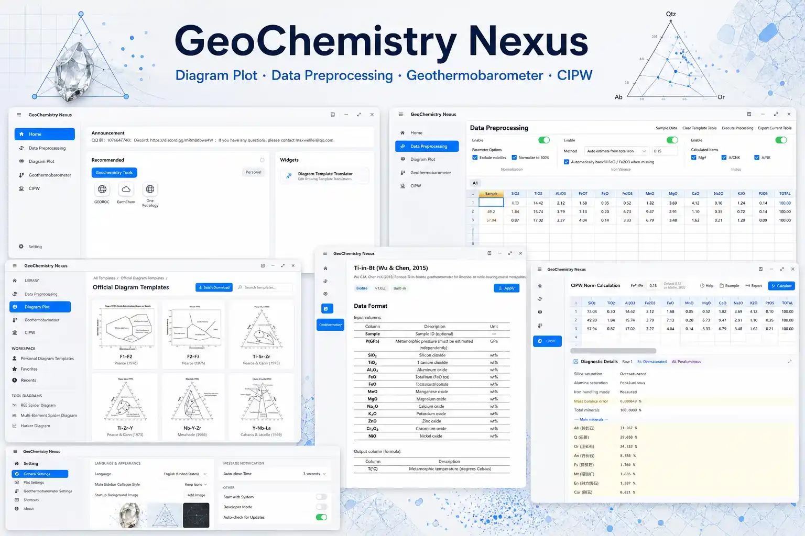

  

<h1 align="center">GeoChemistry Nexus</h1>

Next-Gen Geochemistry & Petrology Discrimination Diagrams and Calculation Tool — A Geoscientist's Best Friend

Discrimination Diagram Plotting | Data Projection | Professional Calculation | Geothermometers

  <a href="./README.md">English</a> |
  <a href="./readme/README.zh-CN.md">简体中文</a> |
  <a href="./readme/README.zh-HK.md">繁體中文</a> |
  <a href="./readme/README.de-DE.md">Deutsch</a> |
  <a href="./readme/README.ja-JP.md">日本語</a> |
  <a href="./readme/README.ko-KR.md">한국어</a>

  

    
    
    
    
    
  

---

## 📖 Project Introduction

**GeoChemistry Nexus** is a high-efficiency tool designed specifically for geochemistry and petrology researchers. It aims to solve common pain points in scientific research, such as tedious plotting processes, complex calculations, and inconsistent formatting.

This software supports **Windows 7** and higher (Win 8/10/11). With its modern interactive design, it helps you quickly navigate the entire process from data import to professional diagram generation.

> 🚀 **Our Vision**: To build an integrated platform combining fundamental geochemistry/petrology diagrams and calculation functions, significantly improving research efficiency and lowering technical barriers, allowing scientists to focus on scientific discovery itself.

  

## ✨ Core Features

* **🎨 Powerful Custom Plotting**
    * Built-in rich drawing primitives (lines, polygons, text, arrows, function curves, etc.).
    * Supports custom scripts to flexibly define data import and calculation rules, meeting deep customization needs.

* **🌐 Native Multi-Language Support**
    * **Diagram Internationalization**: One template supports one-click switching between languages (e.g., English/Chinese)—create once, publish globally.
    * **Interface Localization**: Full interface support for English (US), Simplified Chinese, German, and more.

* **☁️ Cloud Template Ecosystem**
    * Includes a library of diagram templates maintained by both the official team and the community.
    * Supports dynamic updates, allowing you to get the latest scientific diagram templates without upgrading the software.

* **🤝 Convenient Distribution & Collaboration**
    * Supports packing and exporting custom diagram templates, easily enabling the sharing of research results across teams and institutions.

* **🧮 Professional Geological Calculation Module**
    * Integrated geothermometer templates (including single mineral types), meeting diverse parameter calculation requirements.

## ⚡ Quick Start

### Download and Install

Please visit the GitHub **[Releases](https://github.com/MaxwellLei/GeoChemistry-Nexus/releases)** page to download the latest installation package.

### System Requirements
* **OS**: Windows 7 SP1 or higher (Windows 10/11 recommended)
* **Runtime**: .NET 6.0 Runtime (if not installed, the software will usually prompt you or guide the installation automatically)

For detailed tutorials, please visit our [Official Documentation Site](https://geochemistry-nexus.pages.dev/).

## 🗺️ Roadmap

We are building more than just a tool; we are building a research ecosystem. Here are the plans we are currently advancing:

- [ ] **Build a Research Community**: Create an exclusive community for users to upload/share diagrams, including forums and feedback sections.
- [ ] **Expand Calculation Toolbox**: Continuously integrate more common geochemical algorithms and models.
- [ ] **Machine Learning Integration (ML)**: Introduce common ML algorithms to assist in multi-dimensional data analysis.
- [ ] **"New Diagram" Model Support**: Support loading ML-based discrimination models, making complex AI discrimination as simple as using a ternary plot.
- [ ] **AI Smart Research Assistant**:
    - [ ] Phase 1: RAG-based intelligent Q&A and solution generation.
    - [ ] Phase 2: Automated data processing pipelines and analysis agents.

## 💬 Community & Contact

* **Contact Email**: `maxwelllei@qq.com`
* **Forum**: [Geochemistry Nexus](https://geochemistry-nexus.discourse.group/invites/L8pjQMvExB) 

## 👋 Contribute

**GeoChemistry Nexus** is in a period of rapid iteration, and we sincerely invite developers and geological researchers to join us! Whether you are skilled in code or geological theory, there is a place for you here.

**We need your help with:**

1.  🌍 **Localization**: Assist in translating the software interface or documentation.
2.  🧮 **Algorithm R&D**: Provide or improve geochemical calculation algorithms.
3.  💻 **Feature Development**: Participate in C# coding and module building.
4.  📈 **Template Design**: Create professional discrimination diagram templates.
5.  💡 **Feedback & Suggestions**: Tell us what features you need.

---

## Star History

  

