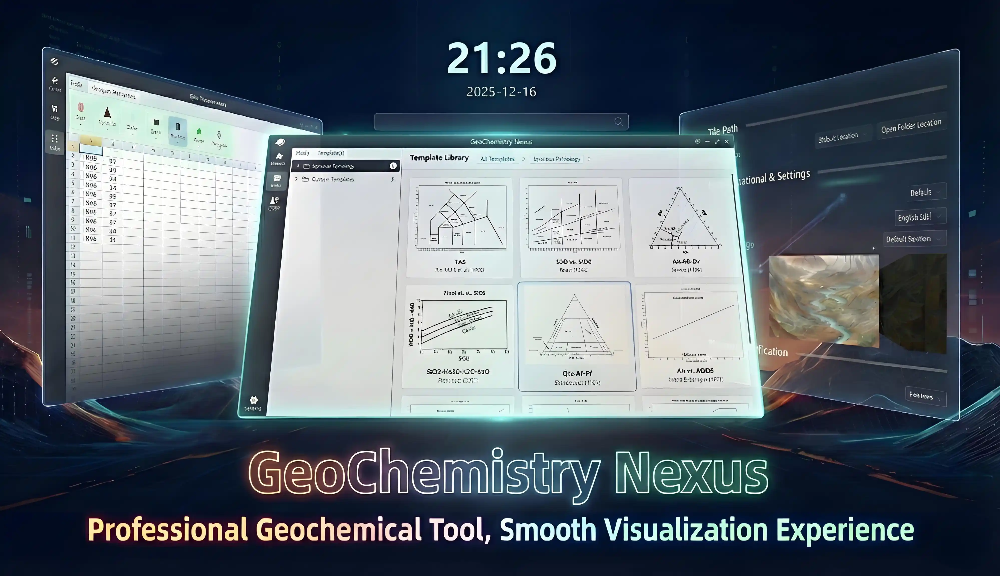

  

<h1 align="center">GeoChemistry Nexus</h1>

次世代の地球化学・岩石学判別図作成および計算ツール —— 地球科学者の頼れるパートナー

判別図の作成 | データの投影 | 専門的な計算 | 地質温度計

  <a href="./README.md">English</a> |
  <a href="./readme/README.zh-CN.md">简体中文</a> |
  <a href="./readme/README.zh-HK.md">繁體中文</a> |
  <a href="./readme/README.de-DE.md">Deutsch</a> |
  <a href="./readme/README.ja-JP.md">日本語</a> |
  <a href="./readme/README.ko-KR.md">한국어</a>

  

    
    
    
    
    
  

---

## 📖 プロジェクト概要

**GeoChemistry Nexus** は、地球化学および岩石学の研究者のために開発された高効率なツールであり、研究プロセスにおける作図の煩わしさ、計算の複雑さ、フォーマットの不統一といった課題を解決することを目的としています。

本ソフトウェアは **Windows 7** SP1 以上のオペレーティングシステム（Win 8/10/11 推奨）をサポートしており、モダンなインタラクションデザインを通じて、データのインポートから専門的な図解生成までの全プロセスを迅速に完了できるよう支援します。

> 🚀 **私たちのビジョン**：基礎的な地球化学・岩石学の図解と計算機能を融合させた統合プラットフォームを構築し、研究効率を飛躍的に向上させ、技術的な障壁を下げることで、科学者が科学的発見そのものに集中できるようにすることです。

  

## ✨ 主な機能

* **🎨 強力なカスタム作図機能**
    * 豊富な描画ツール（線、多角形、テキスト、矢印、関数曲線など）を内蔵。
    * カスタムスクリプトをサポートし、データのインポートや計算ルールを柔軟に設定することで、高度なカスタマイズ要件に対応します。

* **🌐 ネイティブな多言語サポート**
    * **図解の国際化**：同一のテンプレートで日・英・中などの言語をワンクリックで切り替え可能。一つの成果を世界へ発信できます。
    * **インターフェースのローカライズ**：ソフトウェアのUIは、英語（US）、簡体字中国語、ドイツ語などを全面的にサポートしています。

* **☁️ クラウドテンプレート・エコシステム**
    * 公式チームとコミュニティが共同で管理する図解テンプレートライブラリを内蔵。
    * 動的な更新をサポートしており、ソフトウェアをアップグレードすることなく、最新の研究用図解テンプレートをリアルタイムで取得可能です。

* **🤝 手軽な配布とコラボレーション**
    * カスタム図解テンプレートのパッケージ化とエクスポートをサポートし、チームや機関を超えた研究成果の共有を容易に実現します。

* **🧮 専門的な地質計算モジュール**
    * 単鉱物など多種多様な地質温度計（Geothermometer）テンプレートを統合し、多様なパラメータ計算のニーズに対応します。

## ⚡ クイックスタート

### ダウンロードとインストール

最新のインストールパッケージは、GitHubの **[Releases](https://github.com/MaxwellLei/GeoChemistry-Nexus/releases)** ページからダウンロードしてください。

### システム要件
* **OS**: Windows 7 SP1 またはそれ以降 (Windows 10/11 推奨)
* **実行環境**: .NET 6.0 Runtime (未インストールの場合、通常はソフトウェアが通知するか、自動的にインストールを案内します)

詳細な使用チュートリアルについては、私たちの [公式ドキュメントサイト](https://geochemistry-nexus.pages.dev/) をご覧ください。

## 🗺️ ロードマップ (Roadmap)

私たちは単なるツールではなく、研究エコシステムを構築しようとしています。現在推進している計画は以下の通りです：

- [ ] **研究コミュニティの構築**: ユーザーが図解をアップロード・共有できる専用コミュニティの設立（フォーラムやフィードバック機能を含む）。
- [ ] **計算ツールボックスの拡張**: よく使われる地球化学アルゴリズムやモデルの継続的な統合。
- [ ] **機械学習 (ML) の統合**: 一般的なMLアルゴリズムを導入し、多次元データ分析を支援。
- [ ] **「新しい図解」モデルのサポート**: MLベースの判別モデルの読み込みをサポートし、複雑なAI判別を三角図の使用と同じくらい簡単に。
- [ ] **AIスマート研究アシスタント**:
    - [ ] Phase 1: RAGベースのインテリジェントな質疑応答とソリューション生成。
    - [ ] Phase 2: 自動化されたデータ処理パイプラインと分析エージェント。

## 💬 コミュニティと連絡先

* **連絡先メール**: `maxwelllei@qq.com`
* Discord: 
* QQ Group: 1076647740

## 👋 開発への参加

**GeoChemistry Nexus** は現在、高速なイテレーション（反復開発）期間にあります。開発者や地質学研究者の皆様のご参加を心よりお待ちしております！コードが得意な方も、地質学の理論に詳しい方も、ここで活躍できる場所があります。

**以下の分野でご協力をお願いします：**

1.  🌍 **ローカライズ**: ソフトウェアのインターフェースやドキュメントの翻訳支援。
2.  🧮 **アルゴリズム研究開発**: 地球化学計算アルゴリズムの提供または改善。
3.  💻 **機能開発**: C# コードの記述やモジュール構築への参加。
4.  📈 **テンプレートデザイン**: 専門的な判別図テンプレートの作成。
5.  💡 **フィードバックと提案**: 必要な機能を教えてください。

---

## Star History

  

