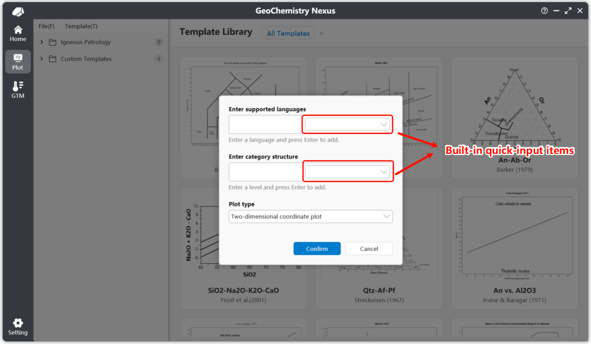

# 🎨 Custom Diagram Templates

For diagram templates not available in the built-in library, users can choose to create custom diagram templates. By customizing a template and packaging it into a template bundle, you can quickly share it with other researchers.

You can also choose to upload your templates to our community for open-source sharing or provide them to developers for inclusion in the built-in library. We sincerely appreciate contributions from anyone involved.

> Note: The diagram template community platform is currently in the planning stages and will be deployed online at a later date. Please stay tuned.

## Creating a New Diagram Template

You can now customize a diagram template via the menu bar by selecting `File` -> `New Drawing Template`, as shown below:


After clicking 【New Drawing Template】, a pop-up window for creating a new diagram template will appear:



For a new custom diagram template, there are three main parts to configure:

1.  **Default Supported Languages**: You can select built-in language shortcuts from the selection box on the right. We provide: Simplified Chinese, Traditional Chinese, American English, Japanese, Russian, Korean, German, and Spanish. You can also manually enter a language code for custom settings. For specific language codes, refer to: [Table of Language Culture Names](https://learn.microsoft.com/en-us/openspecs/windows_protocols/ms-lcid/a9eac961-e77d-41a6-90a5-ce1a8b0cdb9c)

    > Note: Among the default supported languages, the first language entered will be the default language for the diagram. If other languages are not translated or encounter an error, the system will fall back to this default language.

2.  **Diagram Template Classification (Hierarchy)**: Similarly, we provide built-in shortcut classification structures. This setting affects the hierarchical position of your template within the diagram template list.

3.  **Diagram Template Type**: Currently, two types are supported: **2D Coordinate System** and Ternary Plot.

After completing the settings, click 【OK】 to enter the custom drawing interface. Next, we will focus our operations on the 【Edit】 functional bar. After clicking 【Edit】, the system will display a secondary confirmation dialog for editing the diagram. Once confirmed, you will enter Edit Mode, where you can view and use the various tools in the edit functional bar.


## Customizing Diagram Templates

Under the edit functional bar, the following actions are permitted:


* **Save**: Saves the diagram template. After clicking, the program will generate a corresponding thumbnail based on the current drawing state by default.
* **Save As**: Saves the diagram template to a different file location.
* **Add Line**: When enabled, enters "Add Line" mode. Click the first point in the drawing area to start the line, and click a second point to finalize the line object.
* **Add Text**: Also known as annotations. When enabled, enters "Add Text" mode. Click a specific position in the drawing to create it. The default text is `Text`. You can modify the position or content via the properties section in the Layers panel.
* **Add Polygon**: When enabled, enters "Add Polygon" mode. Add a closed polygon by continuously left-clicking to create vertices and right-clicking to close the shape.
* **Add Arrow**: When enabled, enters "Add Arrow" mode. The addition process is similar to creating a line.
* **Add Function**: Upon clicking, a default function `sin(x)` is added with a domain range of [-10, 10]. You can customize your formula in the properties panel.
* **Undo/Redo**: These are disabled if no drawing objects have been created or deleted. By default, only the last 10 operations are stored in the history.
* **Delete**: Deletes drawing objects. First, select the object (e.g., text), then click Delete to remove it.

### Adding Lines

Below is an example of the property panel for adding a line. Through the property panel, you can precisely adjust the position and other attributes of the line.

The location icon button above each coordinate allows you to re-adjust and capture coordinates in the drawing area. Once triggered, left-clicking in the drawing area will automatically set the coordinate to that clicked position.


### Adding Polygons

Below is an example of the property panel for adding a polygon. Polygon objects have a vertex list. A confirmation pop-up will appear when deleting a vertex. You can hold the `Ctrl` key while left-clicking the delete button to delete vertices continuously.


### Adding Text

Below is an example of the property panel for adding text. For text objects, by default, the added text will use the first language set during template creation (the default language) as the initial content.

Since diagrams natively support multiple languages, the settings for multi-language text content will be explained later.


### Adding Functions

Below is an example of the property panel for adding a function. The default function used is `sin(x)`. You only need to enter a formula related to $x$. The default is $y = \text{Formula Content}$.

For a function object, the two most important parameters are: **Domain** and **Sampling Points**. The domain defines the display range of the function. The sampling points control the precision of the function drawing, which in turn affects the accuracy of the mouse-snapping selection algorithm. The default value is `1000`.


## Complete Templates

After completing the basic graphical drawing, a complete template also requires:

1.  **Script Settings**: Defines the input data for the template and the data calculation/plotting algorithm.
2.  **Guide Writing**: Documentation for the diagram's instructions.
3.  **Multi-language**: If the template is set to support multiple languages, the corresponding sections must be filled. This includes both in-diagram text and the diagram guide documentation.

### Script Settings

Script setting is a crucial part of plotting, as it defines the custom plotting logic.

Two parameters are required: **Diagram Variable Parameters** and **Calculation Script**, as shown below:


Scripts are written in `JavaScript` by default. Basic `JavaScript` syntax is not covered here.

For **Data Parameters**, these represent which columns of data need to be read from the data list. **The input rule uses an English comma `,` as a separator.**

**By default, the first parameter can be the `Group` variable**. If not added, the program will add this variable in the background. Its role is to distinguish different data point categories during plotting, thereby affecting the legend display. The remaining parameters should be defined according to the needs of the custom base map.

The script content involves using the aforementioned data parameters (predefined variables) to write calculation algorithms that return the final $[x, y]$ values to project points onto the diagram.

For example, for a TAS diagram, the parameters should be: `SiO2, Na2O, K2O`. The script content would be:

```javascript
// Calculate using variables K2O + Na2O
var result1 = K2O + Na2O;
// Use SiO2
var result2 = SiO2;
// Return two calculated values. Note that for default 2D coordinate images, there are only two return values.
// The first position represents the X return value, and the second represents the Y return value.
[result2, result1]
```

Alternatively, you can write the script as follows:

```javascript
var result = K2O + Na2O
[SiO2, result]
```

Note that the positions of the return values are fixed. In `[x, y]`, the first value will always be X (bottom axis) and the second will be Y (left axis).

:::info

For Ternary Plots, the final return format is `[x, y, z]`, where the first value is X (bottom axis), the second is Y (left axis), and the third is Z (right axis).

:::

### Guide Writing

Writing a guide is an essential step to help other researchers quickly understand the basic information and usage of the base map.

Write the guide in the location shown below. We provide simple toolbar functions to meet regular documentation needs. You can also click `Office Word` on the right to open the guide file in Word for more advanced formatting and features.

> Note: Editing the content in the Diagram Guide panel is only permitted after confirming entry into Edit Mode.

For the guide format, we recommend the following standards:

* **Introduction**: Explains the basic concepts and functions of the base map to help users understand it quickly.
* **Data Format**: Specifies the required input data format and column headers for valid data reading.
* **References**: Lists the references used to create the base map and its content.
* **Contributors**: Names or nicknames of those involved in the base map. You are even encouraged to include your personal website.

### Multi-language

We have established two ways to set up multiple languages:

The first is to use the **Switch Language** option within the drawing functional bar. This allows you to set specific content for a second language.

The second method is to use our homepage widget; we provide a multi-language component to facilitate template localization.

The third method is to directly edit the source file of the diagram template.

> These methods are still being documented...

:::info

Some functions may not yet be fully implemented; we are working to improve them to provide a better user experience. ✨

:::