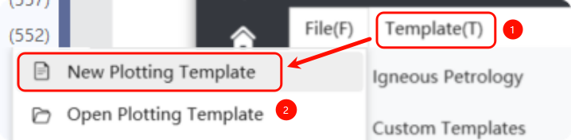
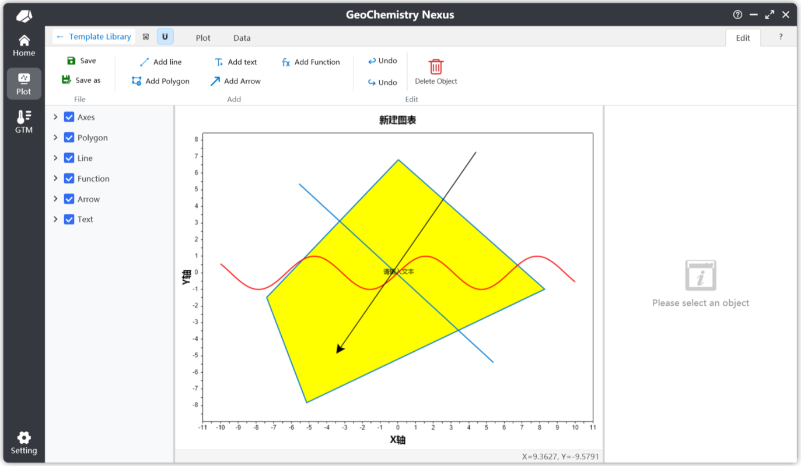

# Custom Chart Templates

:::warning
This documentation is currently being updated / not yet fully updated. Please be patient.
:::

For chart templates not in the built-in library, users can choose to create custom chart templates. By creating custom templates and packaging them into template packages, you can quickly share with other researchers.

You can also choose to upload your template to our community for open source sharing, or provide it to developers for inclusion in the built-in library. We sincerely thank any participant's contribution.

> Note: The chart template community platform is currently in the planning stage and will be launched later. Stay tuned.

## Create a New Chart Template

Now, you can customize chart templates through the menu bar by selecting `File` -> `New Plot Template`, as shown below:



After clicking [New Plot Template], a dialog for creating a new chart template will appear:


For a new custom chart template, there are mainly three parts to configure:

1.  **Default Supported Languages**: You can select built-in language shortcut options from the selection box on the right. We provide: Simplified Chinese, Traditional Chinese, American English, Japanese, Russian, Korean, German, and Spanish. You can also manually enter language codes for custom settings. For specific language codes, please refer to: [Language Culture Names Table](https://learn.microsoft.com/zh-cn/openspecs/windows_protocols/ms-lcid/a9eac961-e77d-41a6-90a5-ce1a8b0cdb9c)

    > Note: Among the default supported languages, the first language entered will be used as the chart's default language. If other languages are not translated or errors occur, the system will fall back to this default language.

2.  **Chart Template Category (Hierarchy)**: Similarly, we provide built-in shortcut category structures. This setting affects your template's hierarchy position in the chart template list.

3.  **Chart Template Type**: Currently supports two types: **2D Coordinate System** and Ternary Diagram.

After completing the settings, click [OK] to enter the custom plotting interface. Next, we focus on the [Edit] function bar. After clicking [Edit], the system will display a secondary confirmation dialog to edit the chart. After confirming, you will enter edit mode, where you can view and use various tools in the edit function bar.



## Custom Chart Templates

Under the edit function bar, the following operations are allowed:


* **Save**: Save the chart template. After clicking, the program will generate a corresponding thumbnail based on the current plotting state by default.
* **Save As**: Save the chart template to a different file location.
* **Add Line**: When enabled, enters "Add Line" mode. Click the first point in the plotting area to start drawing a line, click the second point to complete the line object.
* **Add Text**: Also known as annotation. When enabled, enters "Add Text" mode. Click a specific location in the plot to create. Default text is `Text`. You can modify position or content through the properties section in the layer panel.
* **Add Polygon**: When enabled, enters "Add Polygon" mode. Add a closed polygon by continuously left-clicking to create vertices, right-click to close the shape.
* **Add Arrow**: When enabled, enters "Add Arrow" mode. The adding process is similar to creating a line.
* **Add Function**: After clicking, adds a default function `sin(x)` with domain range [-10, 10]. You can customize the formula in the property panel.
* **Undo/Redo**: If no drawing objects have been created or deleted, these functions will be disabled. By default, only the last 10 operations are stored in history.
* **Delete**: Delete drawing objects. First select an object (e.g., text), then click delete to remove it.

### Add Line

Below is an example of the property panel for adding a line. Through the property panel, you can precisely adjust the line's position and other properties.

The positioning icon button above each coordinate allows you to re-adjust and snap coordinates in the plotting area. Once triggered, left-clicking in the plotting area will automatically set the coordinate to the clicked location.


### Add Polygon

Below is an example of the property panel for adding a polygon. Polygon objects have a vertex list. A confirmation dialog appears when deleting vertices. You can hold the `Ctrl` key and left-click the delete button to continuously delete vertices.


### Add Text

Below is an example of the property panel for adding text. For text objects, by default, the added text will use the first language (default language) set during template creation as the initial content.

Since charts natively support multilingual content, multilingual text content settings will be explained later.


### Add Function

Below is an example of the property panel for adding a function. The default function used is `sin(x)`. You only need to enter a formula related to $x$. Default is `y = formula content`.

For function objects, the two most important parameters are: **Domain** and **Sample Points**. Domain defines the display range of the function. Sample points control the precision of function plotting, which in turn affects the accuracy of mouse snap selection algorithms. Default value is `1000`.


## Complete the Template

After completing basic graphic drawing, a complete template still needs:

1.  **Script Settings**: Define the template's input data and data calculation/plotting algorithms.
2.  **Guide Writing**: Chart documentation.
3.  **Multilingual**: If the template is set to support multiple languages, the corresponding sections must be filled in. This includes in-chart text and chart guide documentation.

### Script Settings

Script settings are the key part of plotting, as they define the custom plotting logic.

Two parameters are required: **Chart Variable Parameters** and **Calculation Script**, as shown below:


Scripts are written in `JavaScript` by default. Basic `JavaScript` syntax is not covered here.

For **data parameters**, these represent which columns of data need to be read from the data list. **Input rules use English comma `,` as separator.**

**By default, the first parameter can be a `Group` variable**. If not added, the program will add this variable in the background. Its role is to distinguish different data point categories during plotting, affecting legend display. Remaining parameters should be defined according to custom basemap needs.

Script content involves writing calculation algorithms using the above data parameters (predefined variables), returning final $[x, y]$ values to project points onto the chart.

For example, for a TAS diagram, parameters should be: `SiO2, Na2O, K2O`. Script content would be:

```javascript
// Calculate using variables K2O + Na2O
var result1 = K2O + Na2O;
// Use SiO2
var result2 = SiO2;
// Return two calculated values. Note, for default 2D coordinate images, there are only two return values.
// First position represents X return value, second represents Y return value.
[result2, result1]
```

Alternatively, you can write the script as follows:

```javascript
var result = K2O + Na2O
[SiO2, result]
```

Note that return value positions are fixed. In `[x, y]`, the first value is always X (bottom axis), the second is Y (left axis).

:::info

For ternary diagrams, the final return format is `[x, y, z]`, where the first value is X (bottom axis), the second is Y (left axis), and the third is Z (right axis).

:::

### Guide Writing

Writing a guide is a necessary step to help other researchers quickly understand the basemap's basic information and usage.

Write the guide at the location shown below. We provide simple toolbar functions to meet routine documentation needs. You can also click `Office Word` on the right to open the guide file in Word for more advanced formatting and features.

> Note: Content in the chart guide panel can only be edited after confirming entry into edit mode.

For guide format, we recommend following these standards:

*   **Introduction**: Explain the basemap's basic concepts and functions to help users quickly understand.
*   **Data Format**: Specify the input data format and column headers required for valid data reading.
*   **References**: List references used to create the basemap and its content.
*   **Contributors**: Names or nicknames of people involved in basemap creation. You are even encouraged to include your personal website.

### Multilingual

We have established two methods for setting up multilingual content:

The first is using the **Switch Language** option in the plotting function bar. This allows you to set specific content for a second language.

The second method is using our home page widget; we provide a multilingual component to facilitate template localization.

The third method is directly editing the chart template's source file.

> These methods are still being documented...

:::info

Some features may not be fully implemented yet; we are working to improve them to provide a better user experience. ✨

:::
