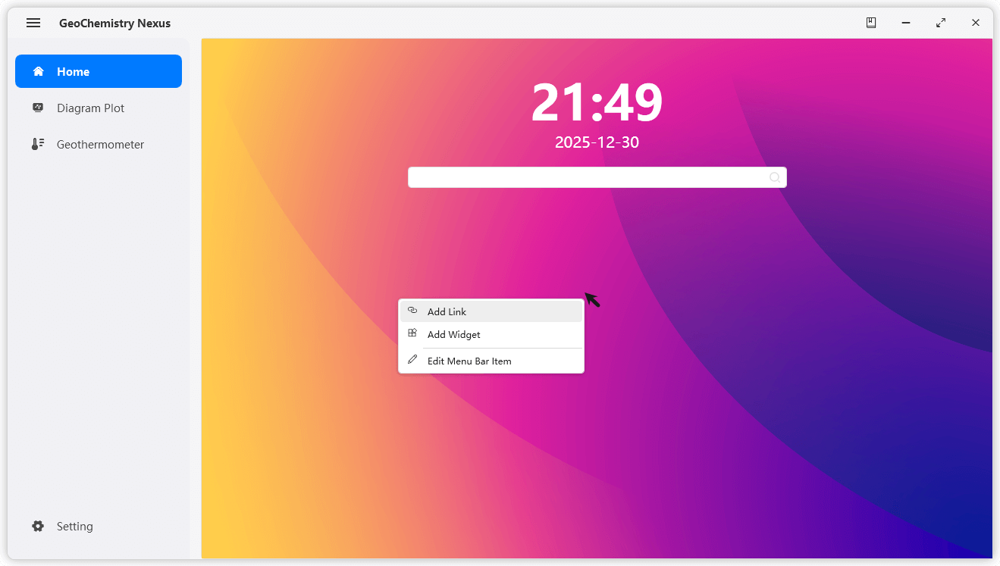

# 🏠 Home

# Goal

The initial design goal of the Home page is to integrate quick access to commonly used websites in the field of Earth Science and provide practical widgets to support related operations and calculations, ultimately boosting research efficiency.

The Home page primarily features **Quick Links** and **Widgets**.

Currently, the software defaults to displaying the system date and time. It also includes a search bar, which acts as a simple link redirect. Any content entered into the search bar will open a Google search in your local browser.

> The search function is currently unavailable.

:::info

As the software continues to be updated, the Home page functionality will become even more practical.

We welcome your valuable feedback to help us improve the software's usability and convenience. 🌹

:::
