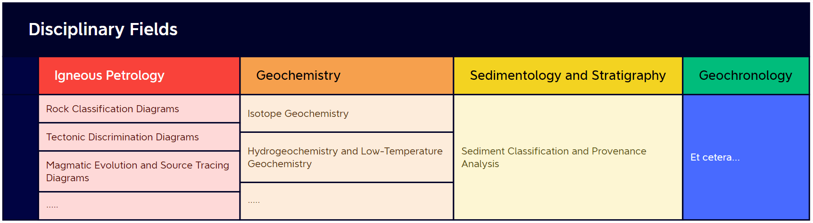
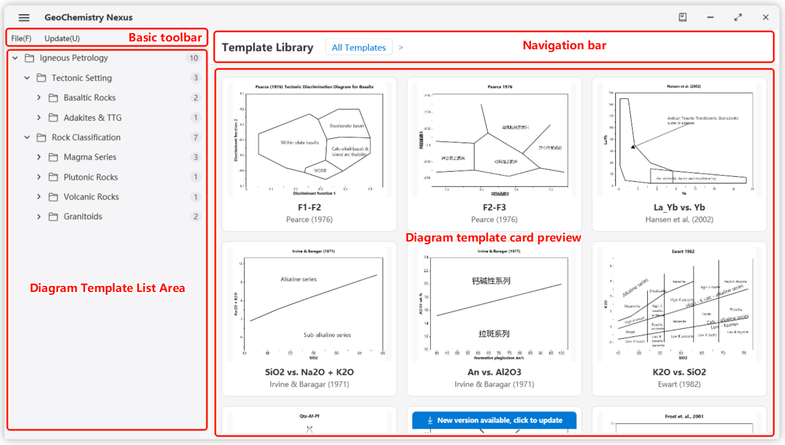
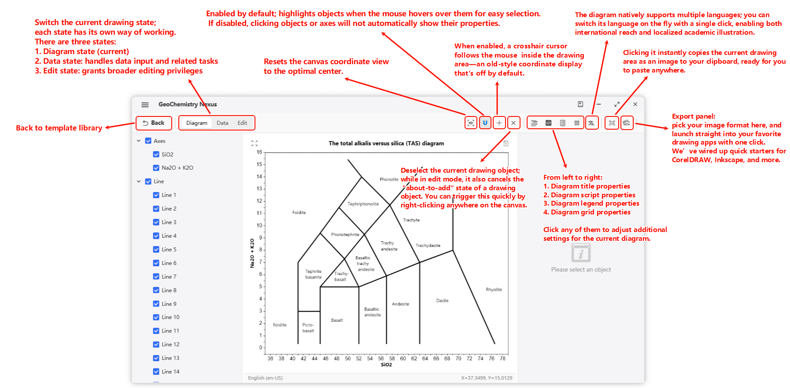
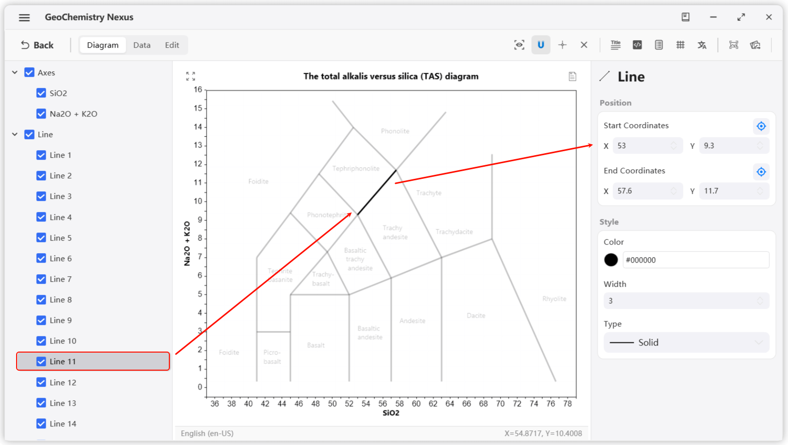
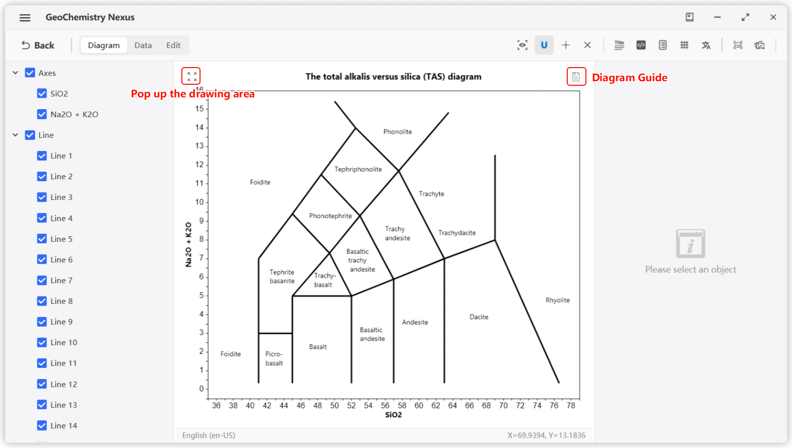
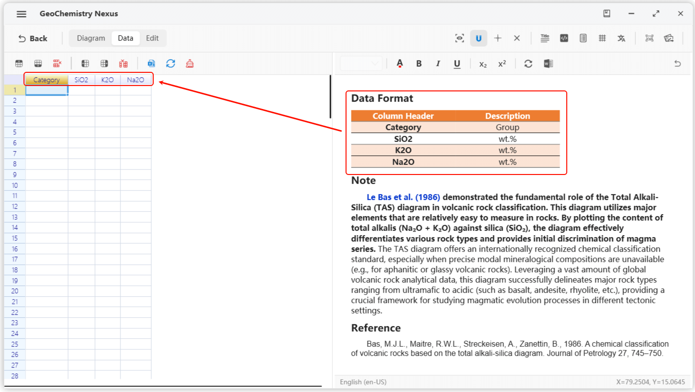
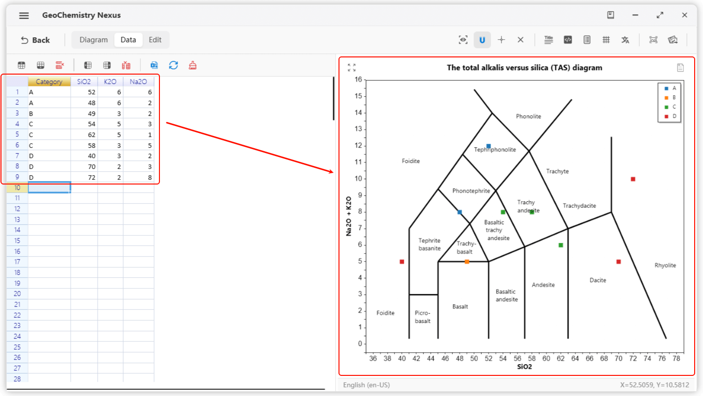

# 🎨 Diagram Plotting

This section introduces the built-in **Geoscience Diagram Plotting Module** of the software. It covers the classification, management, and extension mechanisms (JSON/ZIP) of the **Template Library**, provides a detailed analysis of the **Plotting Interface** layout (Menu Bar, Toolbar, Layer List, Property Panel) and its core operational features (such as data import, layer editing, visual settings, and third-party software integration), and offers a **Complete Workflow Guide**—from selecting a template to exporting the final plot. 🌍

## Objectives

On the Illustrated Plotting page, we will integrate more fundamental geoscience templates, including but not limited to: Tectonic Setting Discrimination Diagrams, Rock Classification Diagrams, and Basic Geothermometer Diagrams. **Our ultimate goal is to create a comprehensive plotting toolkit for geosciences to provide maximum convenience for researchers.** 🧪

The classification logic for templates is currently organized by academic discipline:

:::info

As templates are updated, some classification structures may change.

We welcome valuable feedback during your use to improve the software's usability and convenience. 🌹

:::

## Quick Start

### Template Library

We categorize diagram templates into two main types: **Official Built-in Templates** and **Personal Custom Templates**.

**Official Built-in Templates** are continuously updated and maintained by us. Users can access the latest versions without updating the software, ensuring they always have the most comprehensive and authoritative template resources.

**Personal Custom Templates** are suitable for scenarios where the required template is not found in the official library, or when custom templates need to be created for specific research needs. Users can not only create these templates themselves but also export them for easy sharing with other researchers, facilitating academic exchange and dissemination.

> *In the future, we plan to build a dedicated diagram template community where users can easily create, upload, share, and download various **Personal Custom Templates**, further enhancing the system's flexibility and scalability.*

#### Main Page

By default, the plotting module displays the built-in Geoscience Template Library upon entry. The interface is divided into three main sections:

* **Left - Template List**: Displays all template hierarchies and corresponding templates, including custom template lists.
* **Top Right - Navigation Bar**: Updates based on the selected hierarchy in the template list to show different levels of content.
* **Bottom Right - Template Cards**: Displays the plotting cards under the current hierarchy, including names and preview images.

Select and click a template card to enter the specific plotting interface.

**These templates are highly extensible.** We use the `JSON` format to store core template information and the `ZIP` format to package complete resource bundles. With this design, **researchers can not only create their own templates but also package and share them with others for rapid reuse.**

**The system currently supports server-side storage**, allowing the template list to be dynamically refreshed without needing a software update.

Under local internet conditions, users can manually check for and update the built-in template list via the menu bar, or enable auto-check in settings to ensure the latest resources.

#### Basic toolBar

Menu bar functions are divided into two main categories:

1. **File**: Primarily for creating, opening, and importing templates.
   1. **New Template**: Used to create custom diagrams; clicking this opens an interactive pop-up.
   2. **Open Template**: Used to temporarily open a template; supports `json` files and `zip` resource packages.
   3. **Import Template**: Used to import external template packages (`zip`) into the local custom template list.
2. **Templates**: Primarily for built-in template updates. **Check for Built-in Template Updates**: Used to fetch the latest template lists and updates.

### Plotting Interface

#### Layout

The plotting interface is divided into five main parts:

- **Toolbar**: Includes shortcut buttons and three functional tabs: Plotting, Data, and Editing.
- **Layer List (Objects)**: A list of drawing elements on the template. Clicking an element allows you to modify its properties.
- **Plotting Canvas**: The central area for viewing the plot, importing data, visual settings, and viewing template instructions.
- **Status Bar**: Displays basic plotting information, including the current diagram language and coordinate information.
- **Property Panel**: Displays the attributes of the selected drawing element (e.g., color, size) to achieve the desired visual effect.

#### Plotting Toolbar

The toolbar consists of **Shortcut Buttons** and a **Menu Bar**. **Shortcut Buttons** are for common operations, while the **Menu Bar** provides specific specialized functions.

By default, the system displays the Plotting Toolbar. General users typically do not need to use the **Editing Toolbar**—it is an advanced tool used for creating and extending templates.

### Layer List

Drawing elements are categorized into 7 main types:

- **Line**: Defines basic map boundaries or segments.
- **Text**: Labels and annotations.
- **Polygon**: Closed shapes within the plot.
- **Arrow**: Directional drawing objects.
- **Function**: Allows users to input custom mathematical functions and domains.
- **Axes**: Coordinate axes for the plot.
- **Data Point**: Elements representing imported data.

**Default Rendering Order (Top to Bottom): `Text > Arrow > Point > Function > Line > Polygon > Axes`**.

When you select an element in the layer panel, it will be highlighted on the canvas while other elements become semi-transparent to reduce interference. The Property Panel will then display the relevant attributes for that element. 🔍

Modify these properties to achieve your desired visual style.

:::tip

To deselect all elements, simply right-click anywhere on the canvas or use the **Deselect** button on the toolbar.

:::

### Property Panel & Diagram Guide

## Example Workflow

1. Select a template from the **Template Library** to enter the plotting page.
2. You can either click the diagram guide in the upper-right corner of the drawing area or switch to the data status panel—both will give you a heads-up.
   
   
   
   For example, a template might require four columns: `Category`, `SiO2`, `K2O`, and `Na2O`. Units are usually in `wt.%`. The `Category` header is used to group data and generate legends.
3. Once the requirements are understood, switch to the **Data** tab and input your data to plot the points. After adjusting visual settings, **Export** the final result to complete your workflow.
   