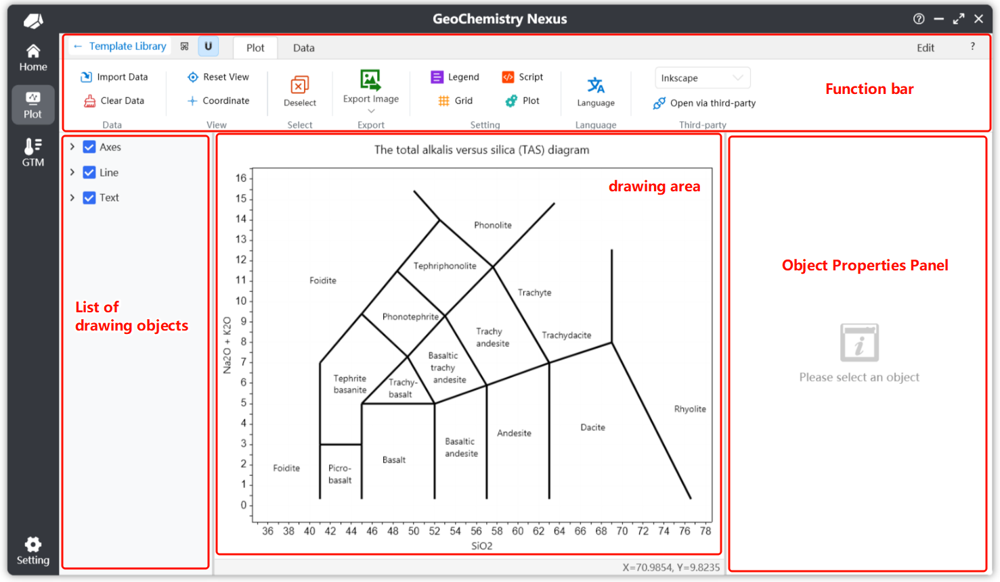
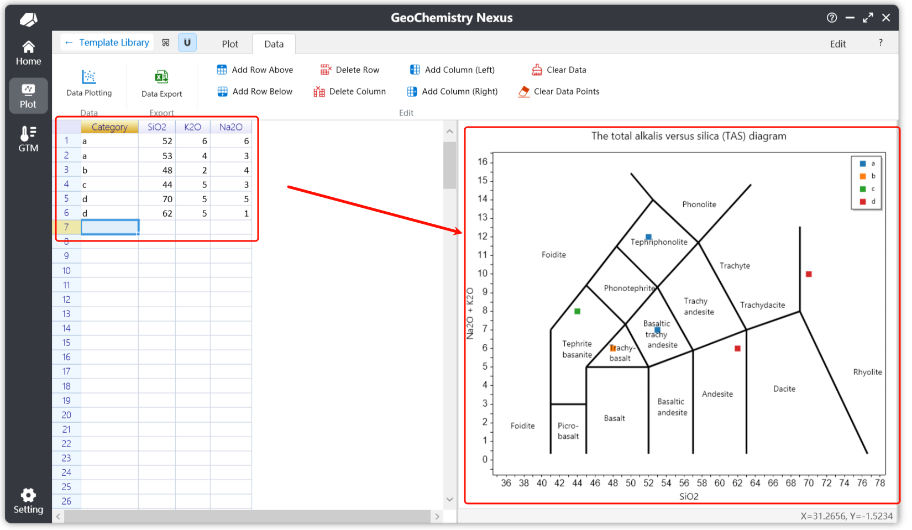

# 🎨 Illustrated Plotting

This section introduces the built-in **Geoscience Illustrated Plotting Module** of the software. It covers the classification, management, and extension mechanisms (JSON/ZIP) of the **Template Library**, provides a detailed analysis of the **Plotting Interface** layout (Menu Bar, Toolbar, Layer List, Property Panel) and its core operational features (such as data import, layer editing, visual settings, and third-party software integration), and offers a **Complete Workflow Guide**—from selecting a template to exporting the final plot. 🌍

## Objectives

On the Illustrated Plotting page, we will integrate more fundamental geoscience templates, including but not limited to: Tectonic Setting Discrimination Diagrams, Rock Classification Diagrams, and Basic Geothermometer Diagrams. **Our ultimate goal is to create a comprehensive plotting toolkit for geosciences to provide maximum convenience for researchers.** 🧪

The classification logic for templates is currently organized by academic discipline:

:::info

As templates are updated, some classification structures may change.

We welcome valuable feedback during your use to improve the software's usability and convenience. 🌹

:::

## Quick Start

### Template Library

#### Main Page

By default, the plotting module displays the built-in Geoscience Template Library upon entry (provided no custom templates are defined). The interface is divided into three main sections:

* **Left - Template List**: Displays all template hierarchies and corresponding templates, including custom template lists.
* **Top Right - Navigation Bar**: Updates based on the selected hierarchy in the template list to show different levels of content.
* **Bottom Right - Template Cards**: Displays the plotting cards under the current hierarchy, including names and preview images.

Select and click a template card to enter the specific plotting interface.

**These templates are highly extensible.** We use the `JSON` format to store core template information and the `ZIP` format to package complete resource bundles. With this design, **researchers can not only create their own templates but also package and share them with others for rapid reuse.**

**The system currently supports server-side storage**, allowing the template list to be dynamically refreshed without needing a software update.

Under local internet conditions, users can manually check for and update the built-in template list via the menu bar, or enable auto-check in settings to ensure the latest resources.

#### Menu Bar

Menu bar functions are divided into two main categories:

1. **File**: Primarily for creating, opening, and importing templates.
   1. **New Template**: Used to create custom diagrams; clicking this opens an interactive pop-up.
   2. **Open Template**: Used to temporarily open a template; supports `json` files and `zip` resource packages.
   3. **Import Template**: Used to import external template packages (`zip`) into the local custom template list.
2. **Templates**: Primarily for built-in template updates.
   1. **Check for Built-in Template Updates**: Used to fetch the latest template lists and updates.
   2. **Check for Classification Structure Updates**: Provides recommended built-in classification structures when creating new templates.

### Plotting Interface

#### Layout

The plotting interface is divided into four main parts:

- **Toolbar**: Includes shortcut buttons and three functional tabs: Plotting, Data, and Editing.
- **Layer List (Objects)**: A list of drawing elements on the template. Clicking an element allows you to modify its properties.
- **Plotting Canvas**: The central area for viewing the plot, importing data, visual settings, and viewing template instructions.
- **Property Panel**: Displays the attributes of the selected drawing element (e.g., color, size) to achieve the desired visual effect.

#### Plotting Toolbar

The toolbar consists of **Shortcut Buttons** and a **Menu Bar**. **Shortcut Buttons** are for common operations, while the **Menu Bar** provides specific specialized functions.

By default, the system displays the Plotting Toolbar. General users typically do not need to use the **Editing Toolbar**—it is an advanced tool used for creating and extending templates.

* **Shortcuts**
  * **Copy to Clipboard**: A quick action located at the top left to copy the current plot as an image.
  * **Snapping**: Enabled by default; highlights objects when the mouse hovers over them for easy selection. If disabled, clicking objects or axes will not automatically show their properties.
  * **Help**: Displays the "Guide" for the current template (if included in the package). It defaults to the software's current language, falling back to English if unavailable.
* **Data**
  * **Import Data**: Switches to the Data tab. You can also click the Data tab manually.
  * **Clear Data**: Clears all plotted data points without deleting the actual data in the spreadsheet.
* **View**
  * **Reset View**: Resets the canvas coordinate view to the optimal center.
  * **Coordinate**: Shows/hides the coordinate tracker. When enabled, it displays the real-time mouse coordinates. This is off by default as the status bar now provides this info.
* **Selection**
  * **Deselect**: Clears the current selection. You can also right-click the canvas to trigger this.
* **Export**
  * **Export**: Saves the current canvas in formats like `.png`, `.jpg`, `.bmp`, `.webp`, and `.svg`. For research papers, we strongly recommend using the **SVG** vector format.
* **Settings**: Adjusts canvas properties.
  * **Legend Settings**: Adjusts legend position, arrangement, and visibility.
  * **Plot Settings**: Adjusts plot titles, axis labels, fonts, and colors.
  * **Script Settings**: Manages data calculation rules for the template. Standard users typically do not need to modify this.
  * **Grid Settings**: Configures the canvas grid properties.
* **Language**: Allows real-time switching of the template language to meet requirements for both domestic and international publication.
* **Third-Party**: Supports direct integration with third-party design software for advanced post-processing. Currently supports **Inkscape**, **CorelDRAW**, and **Adobe Illustrator**. You can set the application paths in the settings.

### Layer List

Drawing elements are categorized into 7 main types:

- **Line**: Defines basic map boundaries or segments.
- **Text**: Labels and annotations.
- **Polygon**: Closed shapes within the plot.
- **Arrow**: Directional drawing objects.
- **Function**: Allows users to input custom mathematical functions and domains.
- **Axes**: Coordinate axes for the plot.
- **Data Point**: Elements representing imported data.

**Default Rendering Order (Top to Bottom): `Text > Arrow > Point > Function > Line > Polygon > Axes`**.

When you select an element in the layer panel, it will be highlighted on the canvas while other elements become semi-transparent to reduce interference. The Property Panel will then display the relevant attributes for that element. 🔍

Modify these properties to achieve your desired visual style.

:::tip

To deselect all elements, simply right-click anywhere on the canvas or use the **Deselect** button on the toolbar.

:::

### Property Panel & Plotting Guide

The Property Panel is empty if no object is selected. Note that the **Property Panel** and the **Plotting Guide** share the same area; they cannot be displayed simultaneously.

## Example Workflow

1. Select a template from the **Template Library** to enter the plotting page.
2. Click the **Help** button (Shortcut) to read the basic information for the template, specifically the **Data Import Requirements**.
   
   For example, a template might require four columns: `Category`, `SiO2`, `K2O`, and `Na2O`. Units are usually in `wt.%`. The `Category` header is used to group data and generate legends.
3. Once the requirements are understood, switch to the **Data** tab and input your data to plot the points. After adjusting visual settings, **Export** the final result to complete your workflow.
   