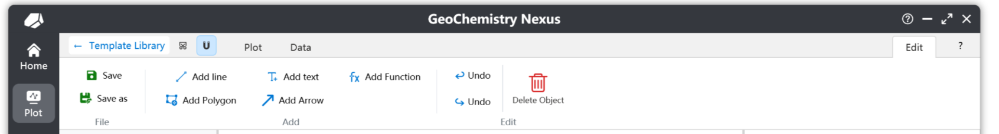
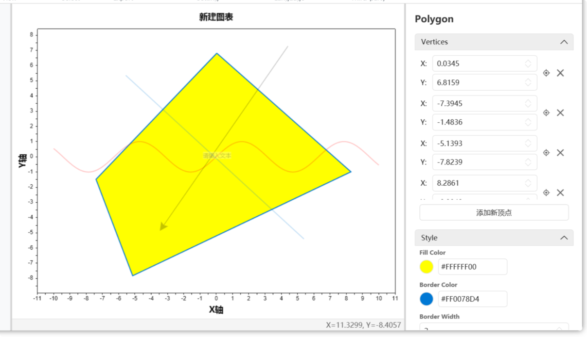
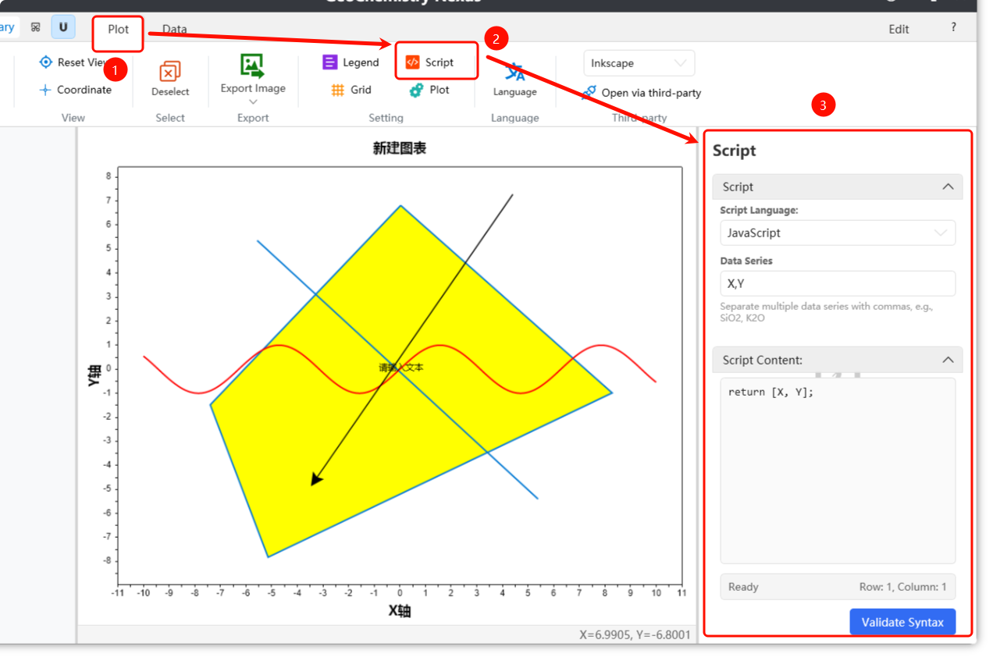

# Benutzerdefinierte Diagrammvorlagen

:::warning
Diese Dokumentation wird derzeit aktualisiert / ist noch nicht vollständig aktualisiert. Bitte haben Sie Geduld.
:::

Für Diagrammvorlagen, die nicht in der integrierten Bibliothek verfügbar sind, können Nutzer benutzerdefinierte Diagrammvorlagen erstellen. Durch das Erstellen benutzerdefinierter Vorlagen und das Verpacken in Vorlagenpakete können Sie diese schnell mit anderen Forschenden teilen.

Sie können Ihre Vorlage auch in unsere Community für Open-Source-Sharing hochladen oder Entwicklern zur Aufnahme in die integrierte Bibliothek bereitstellen. Wir danken jedem Mitwirkenden herzlich.

> Hinweis: Die Plattform der Diagrammvorlagen-Community befindet sich derzeit in der Planungsphase und wird zu einem späteren Zeitpunkt online gestellt. Bitte bleiben Sie dran.

## Erstellen einer neuen Diagrammvorlage

Sie können jetzt über die Menüleiste `Datei` -> `Neue Zeichenvorlage` auswählen, um eine Diagrammvorlage anzupassen, wie unten gezeigt:


Nach dem Klicken auf [Neue Zeichenvorlage] erscheint ein Dialog zum Erstellen einer neuen Diagrammvorlage:


Für eine neue benutzerdefinierte Diagrammvorlage gibt es drei Hauptbereiche zu konfigurieren:

1.  **Standardmäßig unterstützte Sprachen**: Sie können integrierte Sprachkürzel aus dem Auswahlfeld rechts auswählen. Wir bieten: Vereinfachtes Chinesisch, Traditionelles Chinesisch, Amerikanisches Englisch, Japanisch, Russisch, Koreanisch, Deutsch und Spanisch. Sie können auch manuell Sprachcodes für benutzerdefinierte Einstellungen eingeben. Spezifische Sprachcodes finden Sie unter: [Tabelle der Sprachkulturnamen](https://learn.microsoft.com/de-de/openspecs/windows_protocols/ms-lcid/a9eac961-e77d-41a6-90a5-ce1a8b0cdb9c)

    > Hinweis: Unter den standardmäßig unterstützten Sprachen wird die erste eingegebene Sprache als Standardsprache des Diagramms verwendet. Wenn andere Sprachen nicht übersetzt sind oder Fehler auftreten, greift das System auf diese Standardsprache zurück.

2.  **Diagrammvorlagenkategorie (Hierarchie)**: Ebenso bieten wir integrierte Verknüpfungsklassifizierungsstrukturen. Diese Einstellung beeinflusst die hierarchische Position Ihrer Vorlage in der Diagrammvorlagenliste.

3.  **Diagrammvorlagentyp**: Derzeit werden zwei Typen unterstützt: **2D-Koordinatensystem** und Ternäres Diagramm.

Nach Abschluss der Einstellungen klicken Sie auf [OK], um die benutzerdefinierte Zeichenoberfläche aufzurufen. Als Nächstes konzentrieren wir uns auf die Funktionsleiste [Bearbeiten]. Nach dem Klicken auf [Bearbeiten] zeigt das System einen sekundären Bestätigungsdialog zum Bearbeiten des Diagramms an. Nach der Bestätigung gelangen Sie in den Bearbeitungsmodus, in dem Sie die verschiedenen Werkzeuge in der Bearbeitungsfunktionsleiste anzeigen und verwenden können.


## Anpassen von Diagrammvorlagen

Unter der Bearbeitungsfunktionsleiste sind folgende Aktionen zulässig:



* **Speichern**: Speichert die Diagrammvorlage. Nach dem Klicken generiert das Programm standardmäßig ein entsprechendes Miniaturbild basierend auf dem aktuellen Zeichenstatus.
* **Speichern unter**: Speichert die Diagrammvorlage an einem anderen Dateispeicherort.
* **Linie hinzufügen**: Wenn aktiviert, wird der Modus „Linie hinzufügen“ aufgerufen. Klicken Sie auf den ersten Punkt im Zeichenbereich, um die Linie zu beginnen, und auf einen zweiten Punkt, um das Linienobjekt fertigzustellen.
* **Text hinzufügen**: Auch als Anmerkung bekannt. Wenn aktiviert, wird der Modus „Text hinzufügen“ aufgerufen. Klicken Sie auf eine bestimmte Position in der Zeichnung, um ihn zu erstellen. Der Standardtext ist `Text`. Sie können Position oder Inhalt über den Eigenschaftenbereich im Ebenenpanel ändern.
* **Polygon hinzufügen**: Wenn aktiviert, wird der Modus „Polygon hinzufügen“ aufgerufen. Fügen Sie ein geschlossenes Polygon hinzu, indem Sie kontinuierlich mit der linken Maustaste klicken, um Eckpunkte zu erstellen, und mit der rechten Maustaste klicken, um die Form zu schließen.
* **Pfeil hinzufügen**: Wenn aktiviert, wird der Modus „Pfeil hinzufügen“ aufgerufen. Der Hinzufügevorgang ähnelt dem Erstellen einer Linie.
* **Funktion hinzufügen**: Nach dem Klicken wird eine Standardfunktion `sin(x)` mit einem Definitionsbereich von [-10, 10] hinzugefügt. Sie können Ihre Formel im Eigenschaftsfenster anpassen.
* **Rückgängig/Wiederholen**: Diese sind deaktiviert, wenn keine Zeichnungsobjekte erstellt oder gelöscht wurden. Standardmäßig werden nur die letzten 10 Operationen im Verlauf gespeichert.
* **Löschen**: Löscht Zeichnungsobjekte. Wählen Sie zuerst das Objekt aus (z. B. Text) und klicken Sie dann auf Löschen, um es zu entfernen.

### Linien hinzufügen

Unten sehen Sie ein Beispiel für das Eigenschaftsfenster zum Hinzufügen einer Linie. Über das Eigenschaftsfenster können Sie die Position und andere Attribute der Linie präzise anpassen.

Die Positionierungssymbol-Schaltfläche über jeder Koordinate ermöglicht es Ihnen, Koordinaten im Zeichenbereich neu anzupassen und zu erfassen. Nach dem Auslösen setzt ein Linksklick im Zeichenbereich die Koordinate automatisch auf die angeklickte Position.


### Polygone hinzufügen

Unten sehen Sie ein Beispiel für das Eigenschaftsfenster zum Hinzufügen eines Polygons. Polygonobjekte haben eine Eckpunktliste. Beim Löschen eines Eckpunkts wird ein Bestätigungsdialog angezeigt. Sie können die `Strg`-Taste gedrückt halten und mit der linken Maustaste auf die Löschen-Schaltfläche klicken, um Eckpunkte fortlaufend zu löschen.



### Text hinzufügen

Unten sehen Sie ein Beispiel für das Eigenschaftsfenster zum Hinzufügen von Text. Bei Textobjekten verwendet der hinzugefügte Text standardmäßig die erste Sprache, die bei der Vorlagenerstellung festgelegt wurde (die Standardsprache), als ursprünglichen Inhalt.

Da Diagramme nativ mehrere Sprachen unterstützen, werden die Einstellungen für mehrsprachige Textinhalte später erläutert.


### Funktionen hinzufügen

Unten sehen Sie ein Beispiel für das Eigenschaftsfenster zum Hinzufügen einer Funktion. Die verwendete Standardfunktion ist `sin(x)`. Sie müssen nur eine Formel eingeben, die sich auf $x$ bezieht. Der Standardwert ist `y = Formelinhalt`.

Für ein Funktionsobjekt sind die beiden wichtigsten Parameter: **Definitionsbereich** und **Abtastpunkte**. Der Definitionsbereich definiert den Anzeigebereich der Funktion. Die Abtastpunkte steuern die Präzision der Funktionszeichnung, was wiederum die Genauigkeit des Maus-Fangauswahlalgorithmus beeinflusst. Der Standardwert ist `1000`.


## Vorlage vervollständigen

Nach Abschluss der grundlegenden grafischen Zeichnung erfordert eine vollständige Vorlage außerdem:

1.  **Skripteinstellungen**: Definiert die Eingabedaten der Vorlage und den Datenberechnungs-/Zeichenalgorithmus.
2.  **Leitfaden schreiben**: Dokumentation für die Diagrammanweisungen.
3.  **Mehrsprachigkeit**: Wenn die Vorlage so eingestellt ist, dass sie mehrere Sprachen unterstützt, müssen die entsprechenden Abschnitte ausgefüllt werden. Dies umfasst sowohl Text im Diagramm als auch die Dokumentation des Diagrammleitfadens.

### Skripteinstellungen

Die Skripteinstellung ist ein entscheidender Teil des Zeichnens, da sie die benutzerdefinierte Zeichenlogik definiert.

Zwei Parameter sind erforderlich: **Diagrammvariablenparameter** und **Berechnungsskript**, wie unten gezeigt:



Skripte werden standardmäßig in `JavaScript` geschrieben. Die grundlegende `JavaScript`-Syntax wird hier nicht behandelt.

Für **Datenparameter** steht fest, welche Spalten aus der Datenliste gelesen werden müssen. **Eingaberegeln verwenden das englische Komma `,` als Trennzeichen.**

**Standardmäßig kann der erste Parameter eine `Group`-Variable sein**. Wenn sie nicht hinzugefügt wird, fügt das Programm diese Variable im Hintergrund hinzu. Ihre Aufgabe ist es, verschiedene Datenpunktkategorien beim Zeichnen zu unterscheiden und so die Legendenanzeige zu beeinflussen. Die übrigen Parameter sollten entsprechend den Anforderungen der benutzerdefinierten Basiskarte definiert werden.

Der Skriptinhalt umfasst das Schreiben von Berechnungsalgorithmen mit den oben genannten Datenparametern (vordefinierte Variablen) und die Rückgabe der endgültigen $[x, y]$-Werte zur Projektion der Punkte auf das Diagramm.

Beispiel für ein TAS-Diagramm: Die Parameter sollten `SiO2, Na2O, K2O` sein. Der Skriptinhalt wäre:

```javascript
// Berechnung mit den Variablen K2O + Na2O
var result1 = K2O + Na2O;
// SiO2 verwenden
var result2 = SiO2;
// Zwei berechnete Werte zurückgeben. Hinweis: Für standardmäßige 2D-Koordinatenbilder gibt es nur zwei Rückgabewerte.
// Die erste Position ist der X-Rückgabewert, die zweite der Y-Rückgabewert.
[result2, result1]
```

Alternativ können Sie das Skript wie folgt schreiben:

```javascript
var result = K2O + Na2O
[SiO2, result]
```

Beachten Sie, dass die Positionen der Rückgabewerte fest sind. In `[x, y]` ist der erste Wert stets X (untere Achse), der zweite Y (linke Achse).

:::info

Für ternäre Diagramme lautet das endgültige Rückgabeformat `[x, y, z]`, wobei der erste Wert X (untere Achse), der zweite Y (linke Achse) und der dritte Z (rechte Achse) ist.

:::

### Leitfaden schreiben

Das Schreiben eines Leitfadens ist ein notwendiger Schritt, damit andere Forschende die grundlegenden Informationen und die Verwendung der Basiskarte schnell verstehen.

Schreiben Sie den Leitfaden an der unten gezeigten Stelle. Wir bieten einfache Symbolleistenfunktionen für routinemäßige Dokumentationsanforderungen. Sie können auch rechts auf `Office Word` klicken, um die Leitfadendatei in Word für erweiterte Formatierung und Funktionen zu öffnen.

> Hinweis: Inhalte im Diagrammleitfaden-Panel können erst nach Bestätigung des Bearbeitungsmodus bearbeitet werden.

Für das Leitfadenformat empfehlen wir folgende Standards:

*   **Einführung**: Erklärt die grundlegenden Konzepte und Funktionen der Basiskarte, damit Nutzer schnell verstehen.
*   **Datenformat**: Gibt das Eingabedatenformat und die Spaltenüberschriften an, die für gültiges Datenlesen erforderlich sind.
*   **Literatur**: Listet Referenzen auf, die zur Erstellung der Basiskarte und ihres Inhalts verwendet wurden.
*   **Mitwirkende**: Namen oder Spitznamen der an der Erstellung der Basiskarte Beteiligten. Sie sind sogar ermutigt, Ihre persönliche Website anzugeben.

### Mehrsprachigkeit

Wir haben zwei Methoden zur Einrichtung mehrsprachiger Inhalte etabliert:

Die erste ist die Option **Sprache wechseln** in der Zeichenfunktionsleiste. Damit können Sie spezifische Inhalte für eine zweite Sprache festlegen.

Die zweite Methode ist die Nutzung unseres Homepage-Widgets; wir bieten eine mehrsprachige Komponente zur Erleichterung der Vorlagenlokalisierung.

Die dritte Methode ist die direkte Bearbeitung der Quelldatei der Diagrammvorlage.

> Diese Methoden werden noch dokumentiert...

:::info

Einige Funktionen sind möglicherweise noch nicht vollständig implementiert; wir arbeiten daran, sie zu verbessern, um ein besseres Nutzererlebnis zu bieten. ✨

:::
