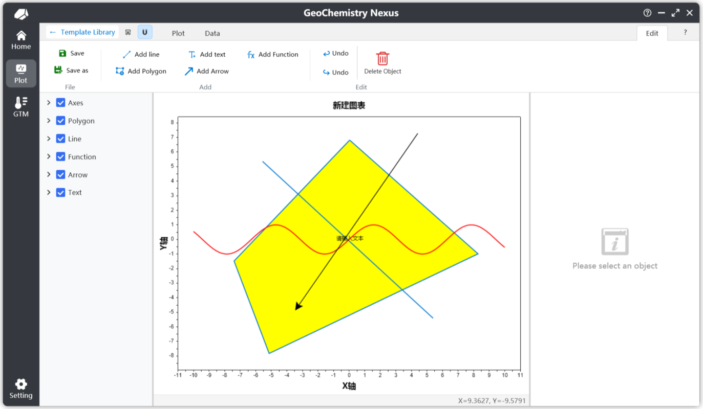
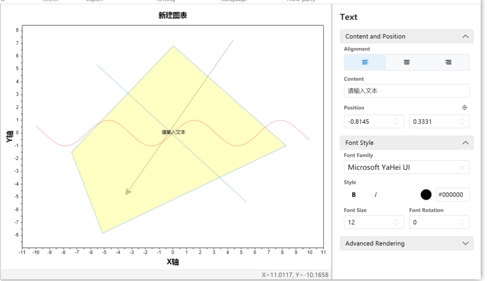
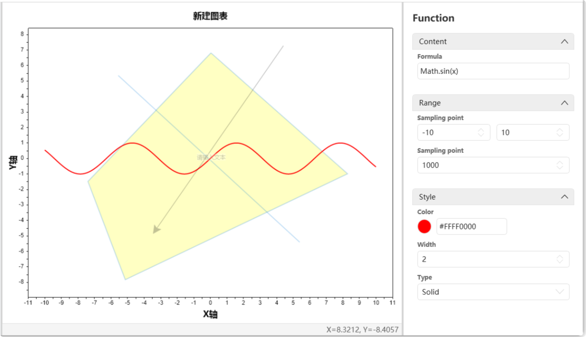

# 🎨 Benutzerdefinierte Diagrammvorlagen

Für Diagrammvorlagen, die nicht in der integrierten Bibliothek verfügbar sind, können Benutzer eigene Diagrammvorlagen erstellen. Durch das Anpassen einer Vorlage und das Verpacken in ein Vorlagenpaket können Sie es schnell mit anderen Forschern teilen.

Sie können auch wählen, Ihre Vorlagen in unsere Community für Open-Source-Sharing hochzuladen oder sie Entwicklern zur Aufnahme in die integrierte Bibliothek bereitzustellen. Wir schätzen Beiträge von jedem Beteiligten sehr.

> Hinweis: Die Plattform der Diagrammvorlagen-Community befindet sich derzeit in der Planungsphase und wird zu einem späteren Zeitpunkt online gestellt. Bitte bleiben Sie dran.

## Erstellen einer neuen Diagrammvorlage

Sie können jetzt eine Diagrammvorlage über die Menüleiste anpassen, indem Sie `Datei` -> `Neue Zeichenvorlage` auswählen, wie unten gezeigt:

Nach dem Klicken auf 【Neue Zeichenvorlage】 erscheint ein Popup-Fenster zum Erstellen einer neuen Diagrammvorlage:

Für eine neue benutzerdefinierte Diagrammvorlage gibt es drei Hauptteile zu konfigurieren:

1.  **Standardmäßig unterstützte Sprachen**: Sie können integrierte Sprachkürzel aus dem Auswahlfeld rechts auswählen. Wir bieten: Vereinfachtes Chinesisch, Traditionelles Chinesisch, Amerikanisches Englisch, Japanisch, Russisch, Koreanisch, Deutsch und Spanisch. Sie können auch manuell einen Sprachcode für benutzerdefinierte Einstellungen eingeben. Spezifische Sprachcodes finden Sie unter: [Tabelle der Sprachkulturnamen](https://learn.microsoft.com/de-de/openspecs/windows_protocols/ms-lcid/a9eac961-e77d-41a6-90a5-ce1a8b0cdb9c)

    > Hinweis: Unter den standardmäßig unterstützten Sprachen wird die erste eingegebene Sprache die Standardsprache für das Diagramm sein. Wenn andere Sprachen nicht übersetzt sind oder auf einen Fehler stoßen, greift das System auf diese Standardsprache zurück.

2.  **Diagrammvorlagenklassifizierung (Hierarchie)**: Ebenso bieten wir integrierte Verknüpfungsklassifizierungsstrukturen. Diese Einstellung beeinflusst die hierarchische Position Ihrer Vorlage innerhalb der Diagrammvorlagenliste.

3.  **Diagrammvorlagentyp**: Derzeit werden zwei Typen unterstützt: **2D-Koordinatensystem** und Ternäres Diagramm.

Nach Abschluss der Einstellungen klicken Sie auf 【OK】, um die benutzerdefinierte Zeichenoberfläche aufzurufen. Als Nächstes konzentrieren wir uns auf die Funktionsleiste 【Bearbeiten】. Nach dem Klicken auf 【Bearbeiten】 zeigt das System einen sekundären Bestätigungsdialog zum Bearbeiten des Diagramms an. Nach der Bestätigung gelangen Sie in den Bearbeitungsmodus, in dem Sie die verschiedenen Werkzeuge in der Bearbeitungsfunktionsleiste anzeigen und verwenden können.

## Anpassen von Diagrammvorlagen

Unter der Bearbeitungsfunktionsleiste sind folgende Aktionen zulässig:

* **Speichern**: Speichert die Diagrammvorlage. Nach dem Klicken generiert das Programm standardmäßig ein entsprechendes Miniaturbild basierend auf dem aktuellen Zeichnungsstatus.
* **Speichern unter**: Speichert die Diagrammvorlage an einem anderen Dateispeicherort.
* **Linie hinzufügen**: Wenn aktiviert, wird der Modus "Linie hinzufügen" aufgerufen. Klicken Sie auf den ersten Punkt im Zeichenbereich, um die Linie zu beginnen, und klicken Sie auf einen zweiten Punkt, um das Linienobjekt fertigzustellen.
* **Text hinzufügen**: Auch als Anmerkungen bekannt. Wenn aktiviert, wird der Modus "Text hinzufügen" aufgerufen. Klicken Sie auf eine bestimmte Position in der Zeichnung, um ihn zu erstellen. Der Standardtext ist `Text`. Sie können die Position oder den Inhalt über den Eigenschaftenbereich im Ebenenbedienfeld ändern.
* **Polygon hinzufügen**: Wenn aktiviert, wird der Modus "Polygon hinzufügen" aufgerufen. Fügen Sie ein geschlossenes Polygon hinzu, indem Sie kontinuierlich mit der linken Maustaste klicken, um Eckpunkte zu erstellen, und mit der rechten Maustaste klicken, um die Form zu schließen.
* **Pfeil hinzufügen**: Wenn aktiviert, wird der Modus "Pfeil hinzufügen" aufgerufen. Der Hinzufügevorgang ähnelt dem Erstellen einer Linie.
* **Funktion hinzufügen**: Nach dem Klicken wird eine Standardfunktion `sin(x)` mit einem Definitionsbereich von [-10, 10] hinzugefügt. Sie können Ihre Formel im Eigenschaftenbereich anpassen.
* **Rückgängig/Wiederholen**: Diese sind deaktiviert, wenn keine Zeichnungsobjekte erstellt oder gelöscht wurden. Standardmäßig werden nur die letzten 10 Operationen im Verlauf gespeichert.
* **Löschen**: Löscht Zeichnungsobjekte. Wählen Sie zuerst das Objekt aus (z. B. Text) und klicken Sie dann auf Löschen, um es zu entfernen.

### Linien hinzufügen

Unten sehen Sie ein Beispiel für das Eigenschaftenbereich zum Hinzufügen einer Linie. Über das Eigenschaftenbereich können Sie die Position und andere Attribute der Linie präzise anpassen.

Die Standort-Symbolschaltfläche über jeder Koordinate ermöglicht es Ihnen, Koordinaten im Zeichenbereich neu anzupassen und zu erfassen. Nach dem Auslösen setzt ein Linksklick im Zeichenbereich die Koordinate automatisch auf diese angeklickte Position.

### Polygone hinzufügen

Unten sehen Sie ein Beispiel für das Eigenschaftenbereich zum Hinzufügen eines Polygons. Polygonobjekte haben eine Eckpunktliste. Beim Löschen eines Eckpunkts wird ein Bestätigungs-Popup angezeigt. Sie können die `Strg`-Taste gedrückt halten, während Sie mit der linken Maustaste auf die Löschen-Schaltfläche klicken, um Eckpunkte kontinuierlich zu löschen.

### Text hinzufügen

Unten sehen Sie ein Beispiel für das Eigenschaftenbereich zum Hinzufügen von Text. Bei Textobjekten verwendet der hinzugefügte Text standardmäßig die erste Sprache, die bei der Vorlagenerstellung festgelegt wurde (die Standardsprache), als ursprünglichen Inhalt.

Da Diagramme nativ mehrere Sprachen unterstützen, werden die Einstellungen für mehrsprachige Textinhalte später erläutert.

### Funktionen hinzufügen

Unten sehen Sie ein Beispiel für das Eigenschaftenbereich zum Hinzufügen einer Funktion. Die verwendete Standardfunktion ist `sin(x)`. Sie müssen nur eine Formel eingeben, die sich auf $x$ bezieht. Der Standardwert ist `y = Formelinhalt`.

Für ein Funktionsobjekt sind die beiden wichtigsten Parameter: **Definitionsbereich** und **Abtastpunkte**. Der Definitionsbereich definiert den Anzeigebereich der Funktion. Die Abtastpunkte steuern die Präzision der Funktionszeichnung, was wiederum die Genauigkeit des Maus-Fangauswahlalgorithmus beeinflusst. Der Standardwert ist `1000`.

## Vollständige Vorlagen

Nach Abschluss der grundlegenden grafischen Zeichnung erfordert eine vollständige Vorlage auch:

1.  **Skripteinstellungen**: Definiert die Eingabedaten für die Vorlage und den Datenberechnungs-/Plot-Algorithmus.
2.  **Leitfaden schreiben**: Dokumentation für die Anweisungen des Diagramms.
3.  **Mehrsprachigkeit**: Wenn die Vorlage so eingestellt ist, dass sie mehrere Sprachen unterstützt, müssen die entsprechenden Abschnitte ausgefüllt werden. Dies umfasst sowohl Text im Diagramm als auch die Dokumentation des Diagrammleitfadens.

### Skripteinstellungen

Die Skripteinstellung ist ein entscheidender Teil des Plottens, da sie die benutzerdefinierte Plot-Logik definiert.

Zwei Parameter sind erforderlich: **Diagrammvariablenparameter** und **Berechnungsskript**, wie unten gezeigt:

Skripte werden standardmäßig in `JavaScript` geschrieben. Die grundlegende `JavaScript`-Syntax wird hier nicht behandelt.
