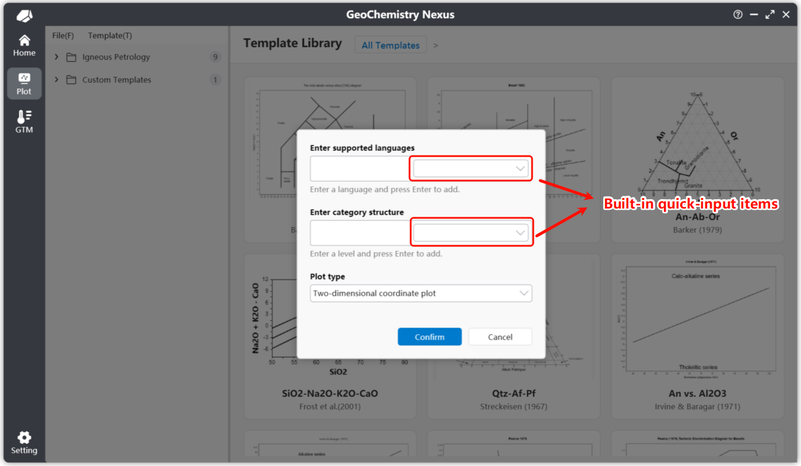

# カスタムチャートテンプレート

:::warning
現在、本ドキュメントは更新中/更新が完了していません。しばらくお待ちください。
:::

内蔵ライブラリにないチャートテンプレートについては、カスタムチャートテンプレートを作成できます。カスタムテンプレートをパッケージ化することで、他の研究者と迅速に共有できます。

テンプレートをコミュニティにアップロードしてオープンソースで共有するか、開発者に提供して内蔵ライブラリへの収録を依頼することもできます。すべての参加者の貢献に心から感謝します。

> 注意：チャートテンプレートコミュニティプラットフォームは現在計画段階にあり、間もなく公開予定です。ご期待ください。

## 新しいチャートテンプレートの作成

現在、メニューバーから `ファイル` -> `新規作図テンプレート` を選択してカスタムチャートテンプレートを作成できます。以下のとおりです：


【新規作図テンプレート】をクリックすると、新しいチャートテンプレート作成用のポップアップが表示されます：



新しいカスタムチャートテンプレートには、主に 3 つの部分を設定する必要があります：

1.  **デフォルトサポート言語**：右側の選択ボックスから内蔵言語のクイックオプションを選択できます。提供言語：簡体中国語、繁体中国語、米国英語、日本語、ロシア語、韓国語、ドイツ語、スペイン語。言語コードを手動入力してカスタム設定も可能です。具体的な言語コードは以下を参照：[言語文化名一覧表](https://learn.microsoft.com/zh-cn/openspecs/windows_protocols/ms-lcid/a9eac961-e77d-41a6-90a5-ce1a8b0cdb9c)

    > 注意：デフォルトサポート言語では、入力した最初の言語がチャートのデフォルト言語になります。他の言語が未翻訳またはエラーが発生した場合、システムはこのデフォルト言語にフォールバックします。

2.  **チャートテンプレート分類（階層）**：同様に、内蔵のクイック分類構造を提供しています。この設定は、チャートテンプレートリスト内でのテンプレートの階層位置に影響します。

3.  **チャートテンプレートタイプ**：現在 2 タイプをサポート：**二次元座標系** と 三元図。

設定完了後、【確定】をクリックしてカスタム作図インターフェースに入ります。次に操作の重心を【編集】機能バーに置きます。【編集】をクリックすると、チャート編集の二次確認ダイアログが表示されます。確認後、編集モードに入り、編集機能バーの各種ツールを確認・使用できます。


## カスタムチャートテンプレート

編集機能バーでは、以下の操作が可能です：


* **保存**：チャートテンプレートを保存。クリック後、プログラムはデフォルトで現在の作図状態に基づき対応するサムネイルを生成します。
* **名前を付けて保存**：チャートテンプレートを別のファイル位置に保存。
* **線を追加**：有効化後、「線追加」モードに入ります。作図エリアの最初の点をクリックして線を描き始め、2 点目をクリックして線オブジェクトを完成させます。
* **テキストを追加**：注釈とも呼ばれます。有効化後、「テキスト追加」モードに入ります。作図内の特定位置をクリックして作成。デフォルトテキストは `Text` です。レイヤーパネルのプロパティ部分で位置や内容を変更できます。
* **多角形を追加**：有効化後、「多角形追加」モードに入ります。連続左クリックで頂点を作成し、右クリックで形状を閉じます。
* **矢印を追加**：有効化後、「矢印追加」モードに入ります。追加プロセスは線の作成と同様です。
* **関数を追加**：クリック後、デフォルト関数 `sin(x)` を追加、定義域は [-10, 10]。プロパティパネルで数式をカスタマイズできます。
* **元に戻す/やり直し**：作図オブジェクトを作成または削除していない場合、これらの機能は無効になります。デフォルトでは、履歴には最後の 10 操作のみが保存されます。
* **削除**：作図オブジェクトを削除。まずオブジェクト（例：テキスト）を選択し、削除をクリックして除去します。

### 線を追加

以下は線追加のプロパティパネル例です。プロパティパネルで線の位置やその他のプロパティを正確に調整できます。

各座標上の位置アイコンボタンで、作図エリア内の座標を再調整・スナップできます。トリガー後、作図エリアを左クリックすると、座標がクリック位置に自動設定されます。


### 多角形を追加

以下は多角形追加のプロパティパネル例です。多角形オブジェクトには頂点リストがあります。頂点削除時に確認ポップアップが表示されます。`Ctrl` キーを押しながら左クリックで削除ボタンを押すと、連続して頂点を削除できます。


### テキストを追加

以下はテキスト追加のプロパティパネル例です。テキストオブジェクトでは、デフォルトで追加されたテキストは、テンプレート作成時に設定した最初の言語（デフォルト言語）を初期内容として使用します。

チャートはネイティブに多言語をサポートしているため、多言語テキスト内容の設定は後述します。


### 関数を追加

以下は関数追加のプロパティパネル例です。使用されるデフォルト関数は `sin(x)` です。$x$ に関連する数式のみ入力すれば十分です。デフォルトは `y = 数式内容` です。

関数オブジェクトでは、最も重要な 2 つのパラメータは：**定義域** と **サンプリング点** です。定義域は関数の表示範囲を定義します。サンプリング点は関数描画の精度を制御し、マウススナップ選択アルゴリズムの精度にも影響します。デフォルト値は `1000` です。


## テンプレートの完成

基本図形の描画完了後、完全なテンプレートには以下も必要です：

1.  **スクリプト設定**：テンプレートの入力データとデータ計算/作図アルゴリズムを定義。
2.  **ガイド作成**：チャート説明ドキュメント。
3.  **多言語**：テンプレートが多言語サポートに設定されている場合、対応部分を必ず記入。図内テキストとチャートガイドドキュメントを含みます。

### スクリプト設定

スクリプト設定は作図の重要部分であり、カスタム作図ロジックを定義します。

2 つのパラメータが必要です：**チャート変数パラメータ** と **計算スクリプト**。以下のとおりです：


スクリプトはデフォルトで `JavaScript` で記述されます。ここでは基本的な `JavaScript` 構文は扱いません。

**データパラメータ**は、データリストからどの列のデータを読み取るかを表します。**入力ルールは英語カンマ `,` を区切り文字として使用します。**

**デフォルトでは、最初のパラメータは `Group` 変数にできます**。追加されていない場合、プログラムはバックグラウンドでこの変数を追加します。作図時に異なるデータ点カテゴリを区別し、凡例表示に影響する役割があります。残りのパラメータはカスタム底図のニーズに応じて定義してください。

スクリプト内容は、上記データパラメータ（事前定義変数）を使用して計算アルゴリズムを記述し、最終的な $[x, y]$ 値を返して点をチャート上に投影します。

例えば TAS 図では、パラメータは：`SiO2, Na2O, K2O` です。スクリプト内容は：

```javascript
// 使用变量 K2O + Na2O 计算
var result1 = K2O + Na2O;
// 使用 SiO2
var result2 = SiO2;
// 返回两个计算值。注意，对于默认的二维坐标图像，只有两个返回值。
// 第一个位置代表 X 返回值，第二个代表 Y 返回值。
[result2, result1]
```

または、スクリプトを以下のように記述できます：

```javascript
var result = K2O + Na2O
[SiO2, result]
```

戻り値の位置は固定であることに注意してください。`[x, y]` では、最初の値が常に X（底軸）、2 番目が Y（左軸）です。

:::info

三元図では、最終戻り値形式は `[x, y, z]` で、最初の値が X（底軸）、2 番目が Y（左軸）、3 番目が Z（右軸）です。

:::

### ガイド作成

ガイド作成は、他の研究者が底図の基本情報と使い方を迅速に理解するための必要ステップです。

以下に示す位置でガイドを作成します。一般的なドキュメントニーズを満たすシンプルなツールバー機能を提供しています。右側の `Office Word` をクリックして Word でガイドファイルを開き、より高度な書式と機能を利用することもできます。

> 注意：編集モードへの確認後にのみ、チャートガイドパネルの内容編集が許可されます。

ガイド形式について、以下の標準に従うことを推奨します：

*   **概要**：底図の基本概念と機能を説明し、ユーザーが迅速に理解できるようにする。
*   **データ形式**：有効なデータ読み取りに必要な入力データ形式と列ヘッダーを指定。
*   **参考文献**：底図とその内容の作成に使用した参考文献を列挙。
*   **コントリビューター**：底図制作に参加した方の氏名またはニックネーム。個人ウェブサイトの記載も推奨します。

### 多言語

多言語設定には 2 つの方法を確立しています：

1 つ目は作図機能バーの **言語切り替え** オプションです。第 2 言語向けの特定内容を設定できます。

2 つ目はホームページウィジェットを使用する方法です。テンプレートローカライズを容易にする多言語コンポーネントを提供しています。

3 つ目はチャートテンプレートのソースファイルを直接編集する方法です。

> これらの方法は現在ドキュメント執筆中です...

:::info

一部の機能は完全に実装されていない場合があります。より良いユーザー体験を提供するため、改善に努めています。 ✨

:::
