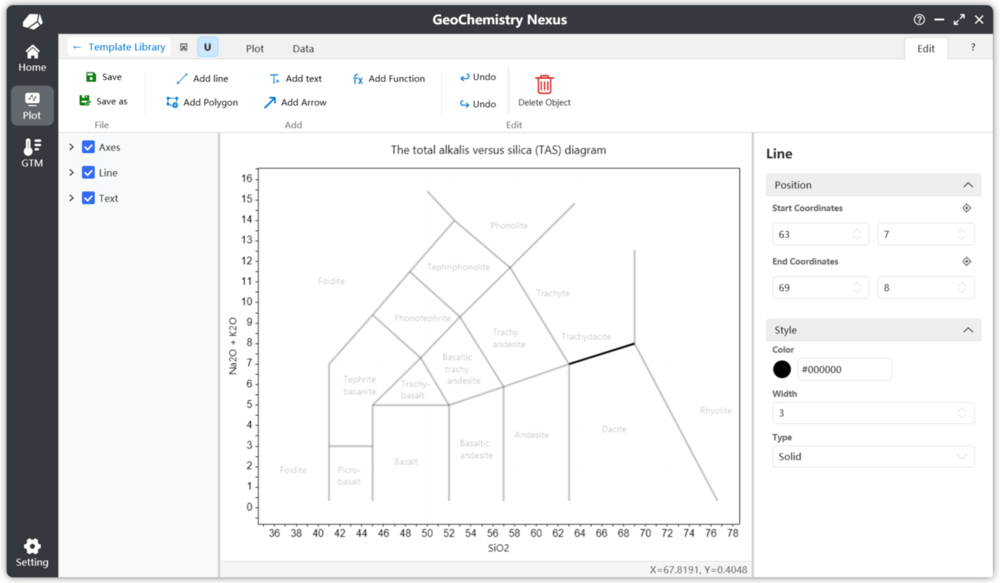
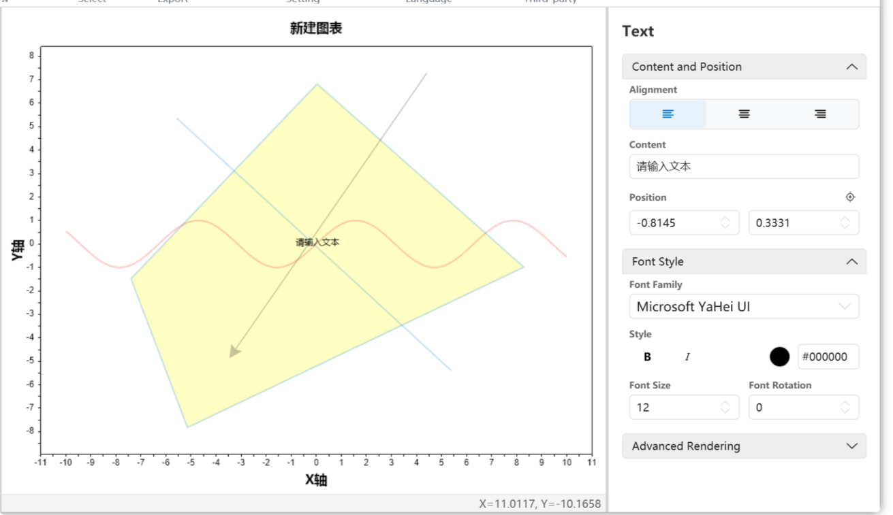
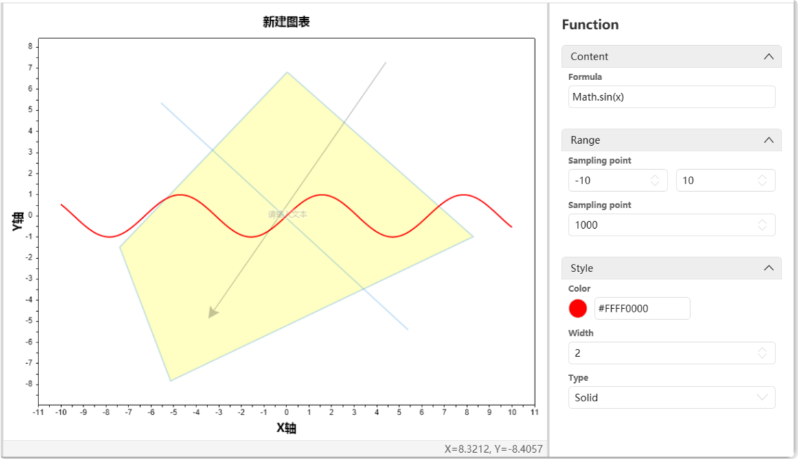

# 사용자 정의 차트 템플릿

:::warning
현재 이 문서는 업데이트 중 / 아직 완전히 업데이트되지 않았습니다. 잠시만 기다려 주세요.
:::

내장 라이브러리에 없는 차트 템플릿의 경우, 사용자 정의 차트 템플릿을 만들 수 있습니다. 사용자 정의 템플릿을 패키지화하여 다른 연구자와 빠르게 공유할 수 있습니다.

템플릿을 커뮤니티에 업로드하여 오픈 소스로 공유하거나, 개발자에게 제공하여 내장 라이브러리에 수록할 수도 있습니다. 모든 참여자의 기여에 진심으로 감사드립니다.

> 참고: 차트 템플릿 커뮤니티 플랫폼은 현재 계획 단계에 있으며, 곧 출시될 예정입니다. 기대해 주세요.

## 새 차트 템플릿 만들기

현재 메뉴 모음에서 `파일` -> `새 작도 템플릿`을 선택하여 사용자 정의 차트 템플릿을 만들 수 있습니다. 아래와 같습니다:


[새 작도 템플릿]을 클릭하면 새 차트 템플릿 생성용 팝업이 나타납니다:


새 사용자 정의 차트 템플릿에는 주로 세 부분을 구성해야 합니다:

1.  **기본 지원 언어**: 오른쪽 선택 상자에서 내장 언어 바로가기 옵션을 선택할 수 있습니다. 제공 언어: 간체 중국어, 번체 중국어, 미국 영어, 일본어, 러시아어, 한국어, 독일어, 스페인어. 언어 코드를 수동 입력하여 사용자 정의 설정도 가능합니다. 구체적인 언어 코드는 다음을 참조: [언어 문화 이름 표](https://learn.microsoft.com/zh-cn/openspecs/windows_protocols/ms-lcid/a9eac961-e77d-41a6-90a5-ce1a8b0cdb9c)

    > 참고: 기본 지원 언어 중 입력한 첫 번째 언어가 차트의 기본 언어가 됩니다. 다른 언어가 번역되지 않았거나 오류가 발생하면 시스템은 이 기본 언어로 대체됩니다.

2.  **차트 템플릿 분류(계층)**: 마찬가지로 내장 바로가기 분류 구조를 제공합니다. 이 설정은 차트 템플릿 목록에서 템플릿의 계층 위치에 영향을 줍니다.

3.  **차트 템플릿 유형**: 현재 두 가지 유형을 지원합니다: **2D 좌표계** 및 삼원도.

설정 완료 후 [확인]을 클릭하여 사용자 정의 작도 인터페이스에 들어갑니다. 다음으로 작업 중심을 [편집] 기능 모음에 둡니다. [편집]을 클릭하면 차트 편집의 이차 확인 대화 상자가 표시됩니다. 확인 후 편집 모드에 들어가 편집 기능 모음의 각종 도구를 확인하고 사용할 수 있습니다.


## 사용자 정의 차트 템플릿

편집 기능 모음에서는 다음 작업이 허용됩니다:


* **저장**: 차트 템플릿을 저장합니다. 클릭 후 프로그램은 기본적으로 현재 작도 상태에 따라 해당 썸네일을 생성합니다.
* **다른 이름으로 저장**: 차트 템플릿을 다른 파일 위치에 저장합니다.
* **선 추가**: 활성화 후 「선 추가」 모드에 들어갑니다. 작도 영역의 첫 번째 점을 클릭하여 선을 그리기 시작하고, 두 번째 점을 클릭하여 선 객체를 완성합니다.
* **텍스트 추가**: 주석이라고도 합니다. 활성화 후 「텍스트 추가」 모드에 들어갑니다. 작도 내 특정 위치를 클릭하여 생성합니다. 기본 텍스트는 `Text`입니다. 레이어 패널의 속성 부분에서 위치나 내용을 변경할 수 있습니다.
* **다각형 추가**: 활성화 후 「다각형 추가」 모드에 들어갑니다. 연속 왼쪽 클릭으로 꼭짓점을 만들고, 오른쪽 클릭으로 형태를 닫습니다.
* **화살표 추가**: 활성화 후 「화살표 추가」 모드에 들어갑니다. 추가 과정은 선 만들기와 유사합니다.
* **함수 추가**: 클릭 후 기본 함수 `sin(x)`를 추가하며, 정의역은 [-10, 10]입니다. 속성 패널에서 수식을 사용자 정의할 수 있습니다.
* **실행 취소/다시 실행**: 작도 객체를 만들거나 삭제하지 않은 경우 이 기능은 비활성화됩니다. 기본적으로 기록에는 마지막 10개 작업만 저장됩니다.
* **삭제**: 작도 객체를 삭제합니다. 먼저 객체(예: 텍스트)를 선택한 후 삭제를 클릭하여 제거합니다.

### 선 추가

아래는 선 추가 속성 패널 예시입니다. 속성 패널을 통해 선의 위치 및 기타 속성을 정확하게 조정할 수 있습니다.

각 좌표 위의 위치 아이콘 버튼으로 작도 영역 내 좌표를 재조정하고 스냅할 수 있습니다. 트리거 후 작도 영역을 왼쪽 클릭하면 좌표가 클릭한 위치로 자동 설정됩니다.



### 다각형 추가

아래는 다각형 추가 속성 패널 예시입니다. 다각형 객체에는 꼭짓점 목록이 있습니다. 꼭짓점 삭제 시 확인 팝업이 표시됩니다. `Ctrl` 키를 누른 채 왼쪽 클릭으로 삭제 버튼을 누르면 연속으로 꼭짓점을 삭제할 수 있습니다.


### 텍스트 추가

아래는 텍스트 추가 속성 패널 예시입니다. 텍스트 객체의 경우 기본적으로 추가된 텍스트는 템플릿 생성 시 설정한 첫 번째 언어(기본 언어)를 초기 내용으로 사용합니다.

차트는 기본적으로 다국어를 지원하므로, 다국어 텍스트 내용 설정은 뒤에서 설명합니다.



### 함수 추가

아래는 함수 추가 속성 패널 예시입니다. 사용되는 기본 함수는 `sin(x)`입니다. $x$와 관련된 수식만 입력하면 됩니다. 기본값은 `y = 수식 내용`입니다.

함수 객체에서 가장 중요한 두 매개변수는: **정의역**과 **샘플링 점**입니다. 정의역은 함수의 표시 범위를 정의합니다. 샘플링 점은 함수 작도 정밀도를 제어하며, 마우스 스냅 선택 알고리즘의 정확도에도 영향을 줍니다. 기본값은 `1000`입니다.



## 템플릿 완성

기본 도형 작도 완료 후, 완전한 템플릿에는 다음도 필요합니다:

1.  **스크립트 설정**: 템플릿의 입력 데이터와 데이터 계산/작도 알고리즘을 정의합니다.
2.  **가이드 작성**: 차트 설명 문서.
3.  **다국어**: 템플릿이 다국어 지원으로 설정된 경우 해당 부분을 반드시 작성해야 합니다. 도 내 텍스트와 차트 가이드 문서를 포함합니다.

### 스크립트 설정

스크립트 설정은 작도의 핵심 부분으로, 사용자 정의 작도 로직을 정의합니다.

두 매개변수가 필요합니다: **차트 변수 매개변수**와 **계산 스크립트**. 아래와 같습니다:


스크립트는 기본적으로 `JavaScript`로 작성됩니다. 여기서는 기본 `JavaScript` 구문을 다루지 않습니다.

**데이터 매개변수**는 데이터 목록에서 어떤 열의 데이터를 읽어야 하는지를 나타냅니다. **입력 규칙은 영어 쉼표 `,`를 구분자로 사용합니다.**

**기본적으로 첫 번째 매개변수는 `Group` 변수일 수 있습니다**. 추가되지 않으면 프로그램이 백그라운드에서 이 변수를 추가합니다. 작도 시 다른 데이터 점 범주를 구분하여 범례 표시에 영향을 주는 역할입니다. 나머지 매개변수는 사용자 정의 배경도 요구에 따라 정의해야 합니다.

스크립트 내용은 위 데이터 매개변수(사전 정의 변수)를 사용하여 계산 알고리즘을 작성하고, 최종 $[x, y]$ 값을 반환하여 점을 차트에 투영합니다.

예를 들어 TAS도의 경우 매개변수는 `SiO2, Na2O, K2O`입니다. 스크립트 내용은:

```javascript
// 使用变量 K2O + Na2O 计算
var result1 = K2O + Na2O;
// 使用 SiO2
var result2 = SiO2;
// 返回两个计算值。注意，对于默认的二维坐标图像，只有两个返回值。
// 第一个位置代表 X 返回值，第二个代表 Y 返回值。
[result2, result1]
```

또는 스크립트를 다음과 같이 작성할 수 있습니다:

```javascript
var result = K2O + Na2O
[SiO2, result]
```

반환값 위치가 고정되어 있음에 유의하세요. `[x, y]`에서 첫 번째 값은 항상 X(하단 축), 두 번째는 Y(왼쪽 축)입니다.

:::info

삼원도의 경우 최종 반환 형식은 `[x, y, z]`이며, 첫 번째 값이 X(하단 축), 두 번째가 Y(왼쪽 축), 세 번째가 Z(오른쪽 축)입니다.

:::

### 가이드 작성

가이드 작성은 다른 연구자가 배경도의 기본 정보와 사용법을 빠르게 이해하도록 돕는 필수 단계입니다.

아래에 표시된 위치에서 가이드를 작성합니다. 일반적인 문서 요구를 충족하는 간단한 도구 모음 기능을 제공합니다. 오른쪽의 `Office Word`를 클릭하여 Word에서 가이드 파일을 열고 더 고급 서식과 기능을 이용할 수도 있습니다.

> 참고: 편집 모드 진입 확인 후에만 차트 가이드 패널 내용 편집이 허용됩니다.

가이드 형식에 대해 다음 표준을 따르는 것을 권장합니다:

*   **소개**: 배경도의 기본 개념과 기능을 설명하여 사용자가 빠르게 이해할 수 있도록 합니다.
*   **데이터 형식**: 유효한 데이터 읽기에 필요한 입력 데이터 형식과 열 헤더를 지정합니다.
*   **참고 문헌**: 배경도 및 내용 작성에 사용된 참고 문헌을 나열합니다.
*   **기여자**: 배경도 제작에 참여한 사람의 이름 또는 닉네임. 개인 웹사이트 포함을 권장합니다.

### 다국어

다국어 설정에는 두 가지 방법을 마련했습니다:

첫 번째는 작도 기능 모음의 **언어 전환** 옵션입니다. 두 번째 언어용 특정 내용을 설정할 수 있습니다.

두 번째 방법은 홈페이지 위젯을 사용하는 것입니다. 템플릿 현지화를 용이하게 하는 다국어 구성 요소를 제공합니다.

세 번째 방법은 차트 템플릿 소스 파일을 직접 편집하는 것입니다.

> 이 방법들은 현재 문서 작성 중입니다...

:::info

일부 기능은 아직 완전히 구현되지 않았을 수 있습니다. 더 나은 사용자 경험을 제공하기 위해 개선에 노력하고 있습니다. ✨

:::
