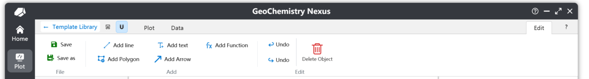
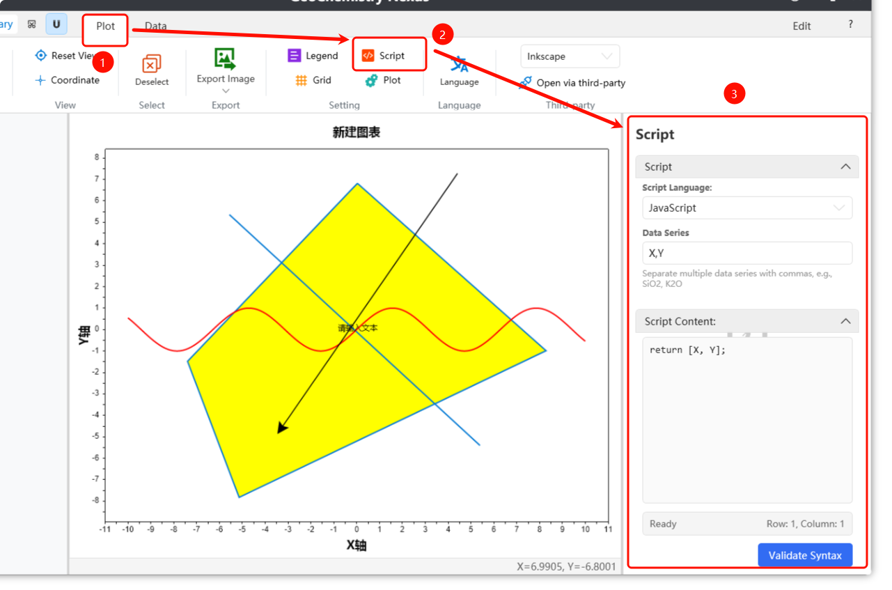

# 🎨 自定義圖表模板

對於內建庫中沒有的圖表模板，使用者可以選擇建立自定義圖表模板。透過自定義模板並將其打包成模板包，你可以快速與其他研究人員分享。

你也可以選擇將你的模板上傳到我們的社群進行開源共享，或提供給開發者以收錄到內建庫中。我們衷心感謝任何參與者的貢獻。

> 注意：圖表模板社群平台目前處於規劃階段，稍後將上線。敬請期待。

## 建立新的圖表模板

現在，你可以透過選單列選擇 `檔案` -> `新建繪圖模板` 來自定義圖表模板，如下所示：


點擊【新建繪圖模板】後，會出現一個用於建立新圖表模板的彈窗：


對於新的自定義圖表模板，主要有三個部分需要配置：

1.  **預設支援語言**：你可以從右側的選擇框中選擇內建的語言快捷選項。我們提供：簡體中文、繁體中文、美式英語、日語、俄語、韓語、德語和西班牙語。你也可以手動輸入語言代碼進行自定義設定。具體的語言代碼請參考：[語言文化名稱表](https://learn.microsoft.com/zh-tw/openspecs/windows_protocols/ms-lcid/a9eac961-e77d-41a6-90a5-ce1a8b0cdb9c)

    > 注意：在預設支援的語言中，輸入的第一個語言將作為圖表的預設語言。如果其他語言未翻譯或遇到錯誤，系統將回退到此預設語言。

2.  **圖表模板分類（層級）**：同樣，我們提供內建的快捷分類結構。此設定影響你的模板在圖表模板列表中的層級位置。

3.  **圖表模板類型**：目前支援兩種類型：**二維座標系** 和 三元圖。

完成設定後，點擊【確定】進入自定義繪圖介面。接下來，我們將操作重心放在【編輯】功能列上。點擊【編輯】後，系統將顯示二次確認對話框以編輯圖表。確認後，你將進入編輯模式，在這裡可以查看和使用編輯功能列中的各種工具。


## 自定義圖表模板

在編輯功能列下，允許進行以下操作：



* **儲存**：儲存圖表模板。點擊後，程式預設會根據當前繪圖狀態生成相應的縮略圖。
* **另存新檔**：將圖表模板儲存到不同的檔案位置。
* **新增線條**：啟用後，進入「新增線條」模式。點擊繪圖區域的第一個點開始畫線，點擊第二個點完成線條物件。
* **新增文字**：也稱為註釋。啟用後，進入「新增文字」模式。點擊繪圖中的特定位置即可建立。預設文字為 `Text`。你可以透過圖層面板中的屬性部分修改位置或內容。
* **新增多邊形**：啟用後，進入「新增多邊形」模式。透過連續左鍵點擊建立頂點來新增封閉多邊形，右鍵點擊閉合形狀。
* **新增箭頭**：啟用後，進入「新增箭頭」模式。新增過程類似於建立線條。
* **新增函數**：點擊後，新增一個預設函數 `sin(x)`，定義域範圍為 [-10, 10]。你可以在屬性面板中自定義公式。
* **復原/重做**：如果沒有建立或刪除繪圖物件，這些功能將被禁用。預設情況下，歷史記錄中僅儲存最後 10 次操作。
* **刪除**：刪除繪圖物件。首先選擇物件（例如文字），然後點擊刪除將其移除。

### 新增線條

下面是新增線條的屬性面板範例。透過屬性面板，你可以精確調整線條的位置和其他屬性。

每個座標上方的定位圖示按鈕允許你重新調整和捕捉繪圖區域中的座標。一旦觸發，在繪圖區域左鍵點擊將自動將座標設定為點擊的位置。


### 新增多邊形

下面是新增多邊形的屬性面板範例。多邊形物件有一個頂點列表。刪除頂點時會出現確認彈窗。你可以按住 `Ctrl` 鍵並左鍵點擊刪除按鈕來連續刪除頂點。


### 新增文字

下面是新增文字的屬性面板範例。對於文字物件，預設情況下，新增的文字將使用模板建立期間設定的第一種語言（預設語言）作為初始內容。

由於圖表原生支援多語言，多語言文字內容的設定將在後面解釋。


### 新增函數

下面是新增函數的屬性面板範例。使用的預設函數是 `sin(x)`。你只需要輸入與 $x$ 相關的公式。預設為 `y = 公式內容`。

對於函數物件，兩個最重要的參數是：**定義域** 和 **取樣點**。定義域定義了函數的顯示範圍。取樣點控制函數繪製的精度，進而影響滑鼠捕捉選擇演算法的準確性。預設值為 `1000`。


## 完善模板

完成基本圖形繪製後，一個完整的模板還需要：

1.  **指令碼設定**：定義模板的輸入資料和資料計算/繪圖演算法。
2.  **指南編寫**：圖表說明文件。
3.  **多語言**：如果模板設定為支援多語言，則必須填寫相應部分。這包括圖內文字和圖表指南文件。

### 指令碼設定

指令碼設定是繪圖的關鍵部分，因為它定義了自定義繪圖邏輯。

需要兩個參數：**圖表變數參數** 和 **計算指令碼**，如下所示：



指令碼預設使用 `JavaScript` 編寫。此處不涵蓋基本的 `JavaScript` 語法。

對於 **資料參數**，這些代表需要從資料列表中讀取哪些列的資料。**輸入規則使用英文逗號 `,` 作為分隔符。**

**預設情況下，第一個參數可以是 `Group` 變數**。如果未新增，程式將在後台新增此變數。它的作用是在繪圖期間區分不同的資料點類別，從而影響圖例顯示。其餘參數應根據自定義底圖的需要進行定義。

指令碼內容涉及使用上述資料參數（預定義變數）編寫計算演算法，返回最終的 $[x, y]$ 值以將點投影到圖表上。

例如，對於 TAS 圖，參數應為：`SiO2, Na2O, K2O`。指令碼內容將是：

```javascript
// 使用變數 K2O + Na2O 計算
var result1 = K2O + Na2O;
// 使用 SiO2
var result2 = SiO2;
// 返回兩個計算值。注意，對於預設的二維座標圖像，只有兩個返回值。
// 第一個位置代表 X 返回值，第二個代表 Y 返回值。
[result2, result1]
```

或者，你可以將指令碼編寫如下：

```javascript
var result = K2O + Na2O
[SiO2, result]
```

注意返回值的位置是固定的。在 `[x, y]` 中，第一個值始終是 X（底軸），第二個是 Y（左軸）。

:::info

對於三元圖，最終返回格式為 `[x, y, z]`，其中第一個值是 X（底軸），第二個是 Y（左軸），第三個是 Z（右軸）。

:::

### 指南編寫

編寫指南是幫助其他研究人員快速了解底圖基本資訊和用法的必要步驟。

在如下所示的位置編寫指南。我們提供簡單的工具列功能以滿足常規文件需求。你也可以點擊右側的 `Office Word` 在 Word 中打開指南檔案以獲得更高級的格式和功能。

> 注意：僅在確認進入編輯模式後才允許編輯圖表指南面板中的內容。

對於指南格式，我們建議遵循以下標準：

*   **簡介**：解釋底圖的基本概念和功能，幫助使用者快速理解。
*   **資料格式**：指定有效資料讀取所需的輸入資料格式和列標題。
*   **參考文獻**：列出用於建立底圖及其內容的參考文獻。
*   **貢獻者**：參與底圖製作的人員姓名或暱稱。甚至鼓勵你包含你的個人網站。

### 多語言

我們建立了兩種設定多語言的方法：

第一種是在繪圖功能列中使用 **切換語言** 選項。這允許你為第二語言設定特定內容。

第二種方法是使用我們的主頁小工具；我們提供了一個多語言組件以方便模板在地化。

第三種方法是直接編輯圖表模板的源文件。

> 這些方法仍在編寫文件中...

:::info

某些功能可能尚未完全實現；我們正在努力改進它們以提供更好的使用者體驗。 ✨

:::
