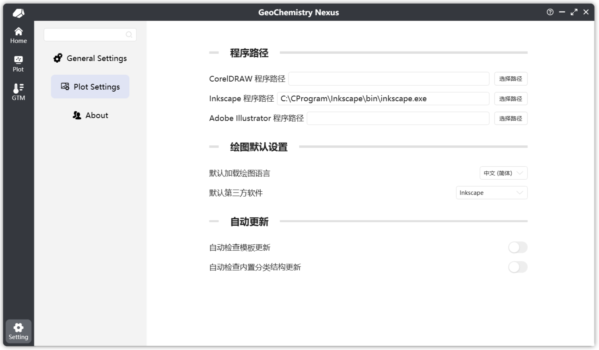

# ⚙️ 設置

軟件的設置部分相當多樣，並將隨著功能擴展而持續更新更多個性化選項。

## 程序常規設置

設置主要分為四個部分：文件路徑、國際化與個性化、消息通知和其他。以下是主要設置的簡要說明：

### 📁 文件路徑

- **保存文件位置**：設置默認的文件保存位置。該路徑將在保存導出的繪圖圖像或將地質溫度計相關計算導出到默認保存文件夾時使用。當然，在設置之後，您也可以在保存時手動指定不同的路徑。

### 🌍 國際化與個性化

- **主題**：軟件界面的主題，包括亮色和暗色模式。
- **語言**：目前支持英語（美國）和簡體中文。
- **啟動背景圖像**：軟件啟動時顯示的背景圖像。

:::info

關於**主題**功能，由於我們處於開發早期階段，暗色模式存在一些UI兼容性問題，因此在正式版本中將隱藏此模式。

對於語言支持，如果您希望幫助為您的國家提供本地化支持，我們熱誠歡迎您參與翻譯！

更多啟動圖像樣式將在未來更新中添加。

:::

### 🗨️ 消息通知

- **自動關閉時間**：在軟件操作過程中，消息通知彈出窗口自動關閉的持續時間。請注意，錯誤和警告消息需要手動關閉。

### ⚙️ 其他

- **隨系統啟動**：軟件將隨系統啟動自動啟動。
- **自動檢查更新**：軟件將在啟動時自動檢查更新；不過由於服務器問題，此功能暫時已禁用，並將在未來版本中恢復。
- **退出方式**：軟件可以通過兩種方式退出：直接退出或最小化到系統托盤。如果您選擇最小化到托盤，可以右鍵單擊托盤圖標並選擇退出來退出軟件。

## 繪圖模塊設置

繪圖模塊設置主要是針對繪圖模塊的部分功能設置，包括但是不限於：

* 第三方程序路徑設定
* 默認第三方程序
* 圖解默認加載語言
* 圖解模板和分類結構自動更新

## 關於

程序的關於頁面。

